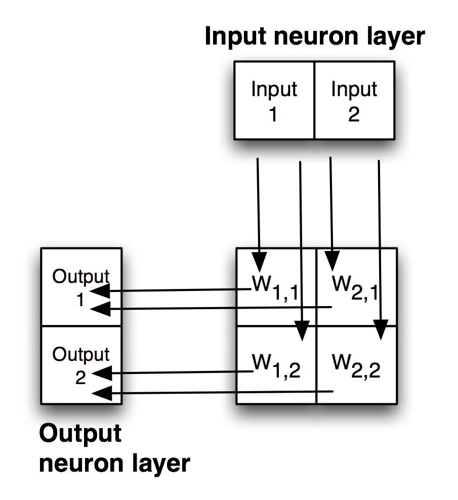
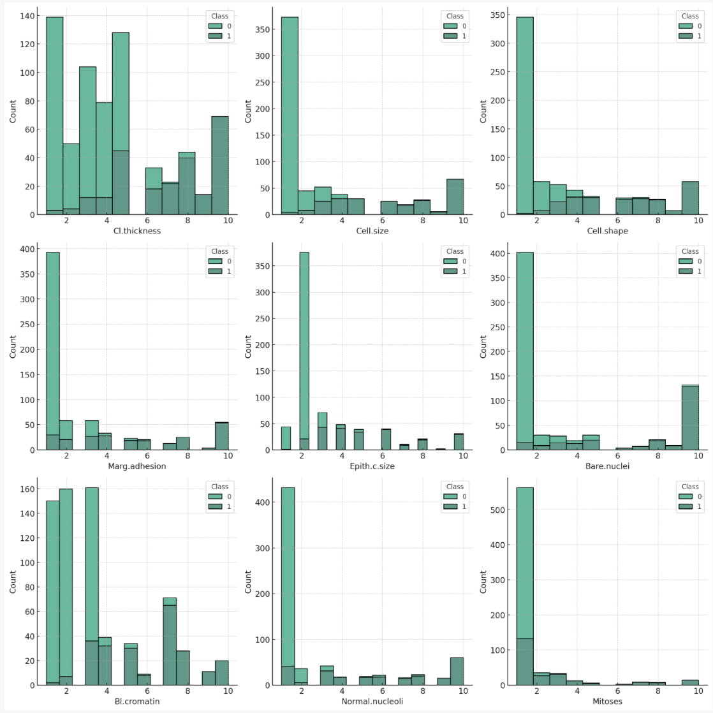
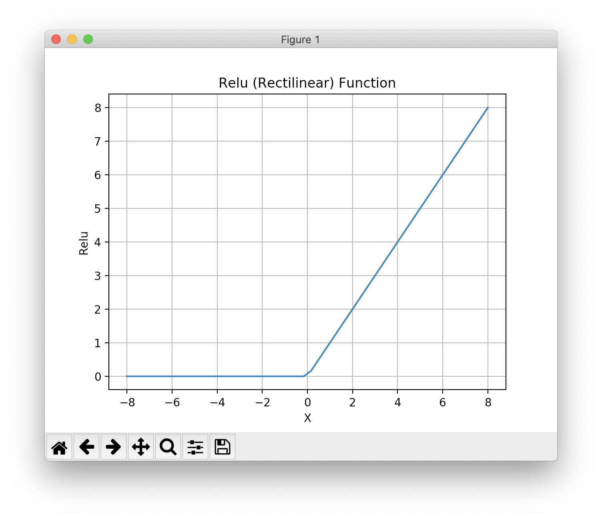

# Deep Learning

Most of my professional career since 2014 has involved Deep Learning, mostly with TensorFlow using the Keras APIs. In the late 1980s I was on a DARPA neural network technology advisory panel for a year. I wrote the first prototype of the SAIC ANSim neural network library commercial product, and I wrote the neural network prediction code for a bomb detector my company designed and built for the FAA for deployment in airports. More recently I have used GAN (generative adversarial networks) models for synthesizing numeric spreadsheet data and LSTM (long short term memory) models to synthesize highly structured text data like nested JSON and for NLP (natural language processing). I have 55 USA and several European patents using neural network and Deep Learning technology.

The Hy language utilities and example programs we develop here all use TensorFlow and Keras "under the hood" to do the heavy lifting. Keras is a simpler to use API for TensorFlow and I usually use Keras rather than the lower level TensorFlow APIs.

There are other libraries and frameworks that might interest you in addition to TensorFlow and Keras. I particularly like the Flux library for the Julia programming language. Currently Python has the most comprehensive libraries for Deep Learning but other languages that support differential computing (more on this later) like Julia and Swift may gain popularity in the future.

Here we will learn a vocabulary for discussing Deep Learning neural network models, look at possible architectures, and show two Hy language examples that should be sufficient to get you familiar to using Keras with the Hy language. If you already have Deep Learning application development experience you might want to skip the following review material and go directly to the Hy language examples.

If you want to use Deep Learning professionally, there are two specific online resources that I recommend: Andrew Ng leads the efforts at [deeplearning.ai](https://www.deeplearning.ai/) and Jeremy Howard leads the efforts at [fast.ai](https://www.fast.ai/). Here I will show you how to use a few useful techniques. Andrew and Jeremy will teach you skills that may lead a professional level of expertise if you take their courses.

There are many Deep Learning neural architectures in current practical use; a few types that I use are:

- Multi-layer perceptron networks with many fully connected layers. An input layer contains placeholders for input data. Each element in the input layer is connected by a two-dimensional weight matrix to each element in the first hidden layer. We can use any number of fully connected hidden layers, with the last hidden layer connected to an output layer.
- Convolutional networks for image processing and text classification. Convolutions, or filters, are small windows that can process input images (filters are two-dimensional) or sequences like text (filters are one-dimensional). Each filter uses a single set of learned weights independent of where the filter is applied in an input image or input sequence.
- Autoencoders have the same number of input layer and output layer elements with one or more hidden fully connected layers. Autoencoders are trained to produce the same output as training input values using a relatively small number of hidden layer elements. Autoencoders are capable of removing noise in input data.
- LSTM (long short term memory) process elements in a sequence in order and are capable of remembering patterns that they have seen earlier in the sequence.
- GAN (generative adversarial networks) models comprise two different and competing neural models, the generator and the discriminator. GANs are often trained on input images (although in my work I have applied GANs to two-dimensional numeric spreadsheet data). The generator model takes as input a "latent input vector" (this is just a vector of specific size with random values) and generates a random output image. The weights of the generator model are trained to produce random images that are similar to how training images look. The discriminator model is trained to recognize if an arbitrary output image is original training data or an image created by the generator model. The generator and discriminator models are trained together.

The core functionality of libraries like TensorFlow are written in C++ and take advantage of special hardware like GPUs, custom ASICs, and devices like Google's TPUs. Most people who work with Deep Learning models don't need to even be aware of the low level optimizations used to make training and using Deep Learning models more efficient. That said, in the following section I am going to show you how simple neural networks are trained and used.

## Simple Multi-layer Perceptron Neural Networks

I use the terms Multi-layer perceptron neural networks, backpropagation neural networks and delta-rule networks interchangeably. Backpropagation refers to the model training process of calculating the output errors when training inputs are passed in the forward direction from input layer, to hidden layers, and then to the output layer. There will be an error which is the difference between the calculated outputs and the training outputs. This error can be used to adjust the weights from the last hidden layer to the output layer to reduce the error. The error is then backprogated backwards through the hidden layers, updating all weights in the model. I have detailed example code in any of my older artificial intelligence books. Here I am satisfied to give you an intuition to how simple neural networks are trained.

The basic idea is that we start with a network initialized with random weights and for each training case we propagate the inputs through the network towards the output neurons, calculate the output errors, and back-up the errors from the output neurons back towards the input neurons in order to make small changes to the weights to lower the error for the current training example. We repeat this process by cycling through the training examples many times.

The following figure shows a simple backpropagation network with one hidden layer. Neurons in adjacent layers are connected by floating point connection strength weights. These weights start out as small random values that change as the network is trained. Weights are represented in the following figure by arrows; in the code the weights connecting the input to the output neurons are represented as a two-dimensional array.

{#nn-backprop}
{width: "80%"}

Each non-input neuron has an activation value that is calculated from the activation values of connected neurons feeding into it, gated (adjusted) by the connection weights. For example, in the above figure, the value of Output 1 neuron is calculated by summing the activation of Input 1 times weight W1,1 and Input 2 activation times weight W2,1 and applying a "squashing function" like Sigmoid or Relu (see figures below) to this sum to get the final value for Output 1's activation value. We want to flatten activation values to a relatively small range but still maintain relative values. To do this flattening we use the Sigmoid function that is seen in the next figure, along with the derivative of the Sigmoid function which we will use in the code for training a network by adjusting the weights.

{#nn-sigmoid}
{width: "70%"}

Simple neural network architectures with just one or two hidden layers are easy to train using backpropagation and I have examples of from-scratch code for this several of my previous books. You can see Java and Common Lisp from-scratch implementations in two of my books that you can read online: [Practical Artificial Intelligence Programming With Java](https://leanpub.com/javaai) and [Loving Common Lisp, or the Savvy Programmer's Secret Weapon](https://leanpub.com/lovinglisp). However, here we are using Hy to write models using the TensorFlow framework which has the huge advantage that small models you experiment with on your laptop can be scaled to more parameters (usually this means more neurons in hidden layers which increases the number of weights in a model) and run in the cloud using multiple GPUs.

Except for pedantic purposes, I now never write neural network code from scratch, instead I take advantage of the many person-years of engineering work put into the development of frameworks like TensorFlow, PyTorch, mxnet, etc. We now move on to two examples built with TensorFlow.

## Deep Learning

Deep Learning models are generally understood to have many more hidden layers than simple multi-layer perceptron neural networks and often comprise multiple simple models combined together in series or in parallel.
Complex architectures can be iteratively developed by manually adjusting the size of model components, changing the components, etc. Alternatively, model architecture search can be automated. At Capital One I used Google's 
[AdaNet project](https://github.com/tensorflow/adanet) that efficiently searches for effective model architectures inside a single TensorFlow session. The model architecture used here is simple: one input layer representing the input values in a sample of University of Wisconsin cancer data, one hidden layer, and an output layer consisting of one neuron whose activation value will be interpreted as a prediction of benign or malignant.

The material in this chapter is intended to serve two purposes:

- If you are already familiar with Deep Learning and TensorFlow then the examples here will serve to show you how to call the TensorFlow APIs from Hy.
- If you have little or no exposure with Deep Learning then the short Hy language examples will provide you with concise code to experiment with and you can then decide to study further.

Once again, I recommend that you consider taking two online Deep Learning course sequences. For no cost, Jeremy Howard provides lessons at [fast.ai](https://fast.ai) that are very good and the later classes use PyTorch which is a framework that is similar to TensorFlow. For a modest cost Andrew Ng provides classes at [deeplearning.ai](https://www.deeplearning.ai/) that use TensorFlow. I have been working in the field of machine learning since the 1980s, but I still take Andrew's online classes to stay up-to-date. In the last eight years I have taken his Stanford University machine learning class twice and also his complete course sequence using TensorFlow. I have also worked through much of Jeremy's material. I recommend both course sequences without reservation.

## Using Keras and TensorFlow to Model The Wisconsin Cancer Data Set

The University of Wisconsin cancer database has 646 samples. Each sample has 9 input values and one output value:

- Cl.thickness: Clump Thickness
- Cell.size: Uniformity of Cell Size
- Cell.shape: Uniformity of Cell Shape
- Marg.adhesion: Marginal Adhesion
- Epith.c.size: Single Epithelial Cell Size
- Bare.nuclei: Bare Nuclei
- Bl.cromatin: Bland Chromatin
- Normal.nucleoli: Normal Nucleoli
- Mitoses: Mitoses
- Class: Class (0 for benign, 1 for malignant)

Each row represents a sample with different measurements related to cell properties, and the final column 'Class' indicates whether the sample is benign (0) or malignant (1).

Let's perform some basic analysis on this data:

- Check for missing values.
- Get the summary statistics of the dataset.
- Check the balance of the classes (benign and malignant).

Here's the analysis:

- Missing Values: There are no missing values in the dataset. Each column has complete data.
- Summary Statistics: The mean and median (50%) values of most features are quite different, indicating that the data distribution for these features might be skewed.
- The range (min to max) for all features is from 1 to 10, indicating that the measurements are likely based on a scale or ranking system of 1 to 10.
- Class Balance: The dataset is somewhat imbalanced. Approximately 65% of the samples are benign (0) and 35% are malignant (1). This imbalance might influence the performance of machine learning models trained on this data.

Now, it would be beneficial to visualize the data to get a better understanding of the distribution of each feature and the relationship between different features:

Here are histograms of each feature, broken down by class (benign or malignant). Some observations:

Cl.thickness, Cell.size, Cell.shape, Marg.adhesion, Epith.c.size, Bare.nuclei, Bl.cromatin, Normal.nucleoli: For these features, higher values seem to be associated with the malignant class. This might suggest that these characteristics are significant in the determination of malignancy.
Mitoses: This feature shows a different trend, with a majority of both benign and malignant cases having low mitoses values. However, there are more malignant cases with higher mitoses values than benign cases.

We will use separate training and test files **hy-lisp-python/deeplearning/train.csv** and **hy-lisp-python/deeplearning/test.csv**. Here are a few samples from the training file:

{linenos=off}
~~~~~~~~
6,2,1,1,1,1,7,1,1,0
2,5,3,3,6,7,7,5,1,1
10,4,3,1,3,3,6,5,2,1
6,10,10,2,8,10,7,3,3,1
5,6,5,6,10,1,3,1,1,1
1,1,1,1,2,1,2,1,2,0
3,7,7,4,4,9,4,8,1,1
1,1,1,1,2,1,2,1,1,0
~~~~~~~~

After you look at this data, if you did not have much experience with machine learning then it might not be obvious how to build a model to accept a sample for a patient like we see in the Wisconsin data set and then predict if the sample implies benign or cancerous outcome for the patient. Using TensorFlow with a simple 
neural network model, we will implement a model in about 40 lines of Hy code to implement this example.

Since there are nine input values we will need nine input neurons that will represent the input values for a sample in either training or separate test data. These nine input neurons (created in lines 9-10 in the following listing) will be completely connected to twelve neurons in a hidden layer. Here, completely connected means that each of the nine input neurons is connected via a weight to each hidden layer neuron. There are 9 * 12 = 108 weights between the input and hidden layers. There is a single output layer neuron that is connected to each hidden layer neuron.

Notice that in lines 12 and 14 in the following listing that we specify a **relu** activation function while the activation function connecting the hidden layer to the output layer uses the **sigmoid** activation function that we saw plotted earlier.

There is an example in the git example repo directory **hy-lisp-python/matplotlib** in the file **plot_relu.hy** that generated the following figure:

{width: "70%"}

The following listing shows the use of the Keras TensorFlow APIs to build a model (lines 9-19) with one input layer, two hidden layers, and an output layer with just one neuron. After we build the model, we define two utility functions **train** (lines 21-23) to train a model given training inputs (**x** argument**) and corresponding training outputs (**y** argument), and we also define **predict** (lines 25-26) using a trained model to make a cancer or benign prediction given test input values (**x-data** argument).

Lines 28-33 show a utility function **load-data** that loads a University of Wisconsin cancer data set CSV file, scales the input and output values to the range [0.0, 1.0] and returns a list containing input (**x-data**) and target output data (**y-data**). You may want to load this example in a REPL and evaluate **load-data** on one of the CSV files.

The function **main** (lines 35-45) loads training and test (evaluation of model accuracy on data not used for training), trains a model, and then tests the accuracy of the model on the test (evaluation) data:

{lang="hylang",linenos=on}
~~~~~~~~
#!/usr/bin/env hy

(import argparse)
(import os)
(import keras.models [Sequential])
(import keras.layers [Dense])
(import keras.optimizers [RMSprop])

(import pandas [read-csv])
(import pandas)

(defn build-model []
  (setv model (Sequential))
  (.add model (Dense 9
                 :activation "relu"))
  (.add model (Dense 12
                 :activation "relu"))
  (.add model (Dense 1
                 :activation "sigmoid"))
  (.compile model :loss      "binary_crossentropy"
                  :optimizer (RMSprop))
  model)

(defn first [x] (get x 0))

(defn train [batch-size model x y]
  (for [it (range 50)]
    (.fit model x y :batch-size batch-size :epochs 10 :verbose False)))

(defn predict [model x-data]
    (.predict model x-data))

(defn load-data [file-name]
  (setv all-data (read-csv file-name :header None))
  (setv x-data10 (. all-data.iloc [#((slice 0 10) [0 1 2 3 4 5 6 7 8])] values))
  (setv x-data (* 0.1 x-data10))
  (setv y-data (. all-data.iloc [#((slice 0 10) [9])] values))
  [x-data y-data])

(defn main []
  (setv xyd (load-data "train.csv"))
  (setv model (build-model))
  (setv xytest (load-data "test.csv"))
  (train 10 model (. xyd [0]) (. xyd [1]))
  (print "* predictions (calculated, expected):")
  (setv predictions (list (map first (predict model (. xytest [0])))))
  (setv expected (list (map first (. xytest [1]))))
  (print
    (list
      (zip predictions expected))))

(main)
~~~~~~~~

The following listing shows the output:

{lang="hylang",linenos=on}
~~~~~~~~
$ uv run hy wisconsin.hy
* predictions (calculated, expected):
[(0.9998953, 1), (0.9999737, 1), (0.9172243, 1), (0.9975936, 1), (0.38985246, 0), (0.4301587, 0), (0.99999213, 1), (0.855, 0), (0.3810781, 0), (0.9999431, 1)]
~~~~~~~~

Let's look at the first test case: the "real" output from the training data is a value of 1 and the calculated predicted value (using the trained model) is 0.9759052. In making predictions, we can choose a cutoff value, 0.5 for example, and interpret any calculated prediction value less than the cutoff as a Boolean *false* prediction and calculated prediction value greater to or equal to the cutoff value is a Boolean *true* prediction.

## Using a LSTM Recurrent Neural Network to Generate English Text Similar to the  Philosopher Nietzsche's Writing

We will translate a Python example program from Google's [Keras documentation (listing of LSTM.py that is included with the example Hy code)](https://keras.io/examples/lstm_text_generation/) to Hy. This is a moderately long example and you can use the original Python and the translated Hy code as a general guide for converting other models implemented in Python using Keras that you want use in Hy. I have, in most cases, kept the same variable names to make it easier to compare the Python and Hy code.

Note that using the nietzsche.txt data set requires a fair amount of memory. If your computer has less than 16G of RAM, you might want to reduce the size of the training text by first running the following example until you see the printout "Create sentences and next_chars data..." then kill the program. The first time you run this program, the training data is fetched from the web and stored locally. You can manually edit the file **~/.keras/datasets/nietzsche.txt** to remove 75% of the data by:

        pushd ~/.keras/datasets/
        mv nietzsche.txt nietzsche_large.txt
        head -800 nietzsche_large.txt > nietzsche.txt
        popd

The next time you run the example, the Keras example data loading utilities will notice a local copy and even though the file now is much smaller, the data loading utilities will not download a new copy.

When I start training a new Deep Learning model I like to monitor system resources using the **top** command line activity, watching for page faults when training on a CPU which might indicate that I am trying to train too large a model for my system memory. If you are using CUDA and a GPU then use the CUDA command line utilities for monitoring the state of the GPU utilization. It is beyond the scope of this introductory tutorial, but the tool [TensorBoard](https://www.tensorflow.org/tensorboard/) is very useful for monitoring the state of model training.

There are a few things that make the following example code more complex than the example using the University of Wisconsin cancer data set. We need to convert each character in the training data to a one-hot encoding which is a vector of all 0.0 values except for a single value of 1.0. I am going to show you a short REPL session so that you understand how this works and then we will look at the complete Hy code example.

{lang="hylang",linenos=on}
~~~~~~~~
$ hy
=> (import keras.callbacks [LambdaCallback])
Using TensorFlow backend.
=> (import keras.src.callbacks [LambdaCallback])
=> (import keras.src.models [Sequential])
=> (import keras.src.layers [Dense LSTM])
=> (import keras.src.optimizers [RMSprop])
=> (import keras.src.utils [get_file])
=> (import numpy :as np) ;; note the syntax for aliasing a module name
=> (import random sys io)
=> (with [f (io.open "/Users/markw/.keras/datasets/nietzsche.txt" :encoding "utf-8")]
... (setv text (.read f)))
=> (cut text 98 130)
'philosophers, in so far as they '
=> (setv chars (sorted (list (set text))))
=> chars
['\n', ' ', '!', '"', "'", '(', ')', ',', '-', '.', '0', '1', '2', '3', '4', '5', '6', '7', '8', '9', ':', ';', '?', 'A', 'B', 'C', 'D', 'E', 'F', 'G', 'H', 'I', 'J', 'K', 'L', 'M', 'N', 'O', 'P', 'Q', 'R', 'S', 'T', 'U', 'V', 'W', 'X', 'Y', '_', 'a', 'b', 'c', 'd', 'e', 'f', 'g', 'h', 'i', 'j', 'k', 'l', 'm', 'n', 'o', 'p', 'q', 'r', 's', 't', 'u', 'v', 'w', 'x', 'y', 'z']
=> (setv char_indices (dict (lfor i (enumerate chars) (, (last i) (first i)))))
=> char_indices
{'\n': 0, ' ': 1, '!': 2, '"': 3, "'": 4, '(': 5, ')': 6, ',': 7, '-': 8, '.': 9, '0': 10, '1': 11, '2': 12, '3': 13, '4': 14, '5': 15, '6': 16, '7': 17, '8': 18, '9': 19, ':': 20, ';': 21, '?': 22, 'A': 23, 'B': 24, 'C': 25, 'D': 26, 'E': 27, 'F': 28, 'G': 29, 'H': 30, 'I': 31, 'J': 32, 'K': 33, 'L': 34, 'M': 35, 'N': 36, 'O': 37, 'P': 38, 'Q': 39, 'R': 40, 'S': 41, 'T': 42, 'U': 43, 'V': 44, 'W': 45, 'X': 46, 'Y': 47, '_': 48, 'a': 49, 'b': 50, 'c': 51, 'd': 52, 'e': 53, 'f': 54, 'g': 55, 'h': 56, 'i': 57, 'j': 58, 'k': 59, 'l': 60, 'm': 61, 'n': 62, 'o': 63, 'p': 64, 'q': 65, 'r': 66, 's': 67, 't': 68, 'u': 69, 'v': 70, 'w': 71, 'x': 72, 'y': 73, 'z': 74}
=> (setv indices_char (dict (lfor i (enumerate chars) i)))
=> indices_char
{0: '\n', 1: ' ', 2: '!', 3: '"', 4: "'", 5: '(', 6: ')', 7: ',', 8: '-', 9: '.', 10: '0', 11: '1', 12: '2', 13: '3', 14: '4', 15: '5', 16: '6', 17: '7', 18: '8', 19: '9', 20: ':', 21: ';', 22: '?', 23: 'A', 24: 'B', 25: 'C', 26: 'D', 27: 'E', 28: 'F', 29: 'G', 30: 'H', 31: 'I', 32: 'J', 33: 'K', 34: 'L', 35: 'M', 36: 'N', 37: 'O', 38: 'P', 39: 'Q', 40: 'R', 41: 'S', 42: 'T', 43: 'U', 44: 'V', 45: 'W', 46: 'X', 47: 'Y', 48: '_', 49: 'a', 50: 'b', 51: 'c', 52: 'd', 53: 'e', 54: 'f', 55: 'g', 56: 'h', 57: 'i', 58: 'j', 59: 'k', 60: 'l', 61: 'm', 62: 'n', 63: 'o', 64: 'p', 65: 'q', 66: 'r', 67: 's', 68: 't', 69: 'u', 70: 'v', 71: 'w', 72: 'x', 73: 'y', 74: 'z'}
=> (setv maxlen 40)
=> (setv s "Oh! I saw 1 dog (yesterday)")
=> (setv x_pred (np.zeros [1 maxlen (len chars)]))
=> (for [[t char] (lfor j (enumerate s) j)]
... (setv (get x_pred 0 t (get char_indices char)) 1))
=> x_pred
array([[[0., 0., 0., ..., 0., 0., 0.],
        [0., 0., 0., ..., 0., 0., 0.],
        [0., 0., 1., ..., 0., 0., 0.],   // here 1. is the third character "!"
        ...,
        [0., 0., 0., ..., 0., 0., 0.],
        [0., 0., 0., ..., 0., 0., 0.],
        [0., 0., 0., ..., 0., 0., 0.]]])
=> 
~~~~~~~~

For lines 48-54, each line represents a single character one-hot encoded. Notice how the third character shown on line 50 has a value of "1." at index 2, which corresponds to the one-hot encoding of the letter "!".

Now that you have a feeling for how one-hot encoding works, hopefully the following example will make sense to you. We will further discuss one-hot-encoding after the next code listing. For training, we take 40 characters (the value of the variable **maxlen**) at a time, and using one one-hot encode a character at a time as input and the target output will be the one-hot encoding of the following character in the input sequence. We are iterating on training the model for a while and then given a few characters of text, predict a likely next character - and keep repeating this process. The generated text is then used as input to the model to generate yet more text. You can repeat this process until you have generated sufficient text.

This is a powerful technique that I used to model JSON with complex deeply nested schemas and then generate synthetic JSON in the same schema as the training data. Here, training a model to mimic the philosopher Nietzsche's writing is much easier than learning highly structured data like JSON:

{lang="hylang",linenos=on}
~~~~~~~~
#!/usr/bin/env hy

;; This example was translated from the Python example in the Keras
;; documentation at: https://keras.io/examples/lstm_text_generation/ that
;; was written with very old versions of tensorflow and keras.
;; This Hy version is translated to use current versions of keras and
;; tensorflow:

(import keras.src.callbacks [LambdaCallback])
(import keras.src.models [Sequential])
(import keras.src.layers [Dense LSTM])
(import keras.src.optimizers [RMSprop])
(import keras.src.utils [get_file])
(import numpy :as np) ;; note the syntax for aliasing a module name
(import random sys io)

(setv path
      (get_file        ;; this saves a local copy in ~/.keras/datasets
        "nietzsche.txt"
        :origin "https://s3.amazonaws.com/text-datasets/nietzsche.txt"))

(with [f (io.open path :encoding "utf-8")]
  (setv text (.read f))) ;; note: sometimes we use (.lower text) to
                         ;;       convert text to all lower case
(print "corpus length:" (len text))

(setv chars (sorted (list (set text))))
(print "total chars (unique characters in input text):" (len chars))
;;(setv char_indices (dict (lfor i (enumerate chars) (, (last i) (first i)))))
(setv char_indices (dict (lfor i (enumerate chars) #((get i -1) (get i 0)))))
(setv indices_char (dict (lfor i (enumerate chars) i)))

;; cut the text in semi-redundant sequences of maxlen characters
(setv maxlen 40)
(setv step 3) ;; when we sample text, slide sampling window 3 characters
(setv sentences (list))
(setv next_chars (list))

(print "Create sentences and next_chars data...")
(for [i (range 0 (- (len text) maxlen) step)]
  (.append sentences (cut text i (+ i maxlen)))
  (.append next_chars (get text (+ i maxlen))))

(print "Vectorization...")
(setv x (np.zeros [(len sentences) maxlen (len chars)] :dtype bool))
(setv y (np.zeros [(len sentences) (len chars)] :dtype bool))
(for [[i sentence] (lfor j (enumerate sentences) j)]
  (for [[t char] (lfor j (enumerate sentence) j)]
    (setv (get x i t (get char_indices char)) 1))
  (setv (get y i (get char_indices (get next_chars i))) 1))
(print "Done creating one-hot encoded training data.")

(print "Building model...")
(setv model (Sequential))
(.add model (LSTM 128 :input_shape [maxlen (len chars)]))
(.add model (Dense (len chars) :activation "softmax"))

(setv optimizer (RMSprop 0.01))
(.compile model :loss "categorical_crossentropy" :optimizer optimizer)

(defn sample [preds &optional [temperature 1.0]]
  (setv preds (.astype (np.array preds) "float64"))
  (setv preds (/ (np.log preds) temperature))
  (setv exp_preds (np.exp preds))
  (setv preds (/ exp_preds (np.sum exp_preds)))
  (setv probas (np.random.multinomial 1 preds 1))
  (np.argmax probas))

(defn on_epoch_end [epoch [not-used None]]
  (print)
  (print "----- Generating text after Epoch:" epoch)
  (setv start_index (random.randint 0 (- (len text) maxlen 1)))
  (for [diversity [0.2 0.5 1.0 1.2]]
    (print "----- diversity:" diversity)
    (setv generated "")
    (setv sentence (cut text start_index (+ start_index maxlen)))
    (setv generated (+ generated sentence))
    (print "----- Generating with seed:" sentence)
    (sys.stdout.write generated)
    (for [i (range 400)]
      (setv x_pred (np.zeros [1 maxlen (len chars)]))
      (for [[t char] (lfor j (enumerate sentence) j)]
        (setv (get x_pred 0 t (get char_indices char)) 1))
;;      (setv preds (first (model.predict x_pred :verbose 0)))
      (setv preds (get (model.predict x_pred :verbose 0) 0))
      ;;;(print "** preds=" preds)
      (setv next_index (sample preds diversity))
      (setv next_char (get indices_char next_index))
      (setv sentence (+ (cut sentence 1) next_char))
      (sys.stdout.write next_char)
      (sys.stdout.flush))
    (print)))

(setv print_callback (LambdaCallback :on_epoch_end on_epoch_end))

(model.fit x y :batch_size 128 :epochs 60 :callbacks [print_callback])
~~~~~~~~

We run this example using:

    uv run hy lstm.hy

In lines 52-54 we defined a model using the Keras APIs and in lines 56-57 compiled the model using a [categorical crossentropy loss function with an RMSprop optimizer](https://keras.io/optimizers/).

In lines 59-65 we define a function **sample** that takes a first required argument **preds** which is a one-hot predicted encoded character that might look like (maxlen or 40 values):

[2.80193929e-02 6.78635418e-01 7.85831537e-04 4.92034527e-03
   . . .
 6.62320468e-04 9.14627407e-03 2.31375365e-04]

Now, here the predicted one hot encoding values are not strictly 0 or 1, rather they are small floating point numbers of a single number much larger than the others. The largest number is 6.78635418e-01 at index 1 which corresponds to a one-hot encoding for a " " space character.

If we print out the number of characters in text and the unique list of characters (variable **chars**) in the training text file nietzsche.txt we see:

{linenos=off}
~~~~~~~~
corpus length: 600893
['\n', ' ', '!', '"', "'", '(', ')', ',', '-', '.', '0', '1', '2', '3', '4', '5', '6', '7', '8', '9', ':', ';', '=', '?', 'A', 'B', 'C', 'D', 'E', 'F', 'G', 'H', 'I', 'J', 'K', 'L', 'M', 'N', 'O', 'P', 'Q', 'R', 'S', 'T', 'U', 'V', 'W', 'X', 'Y', 'Z', '[', ']', '_', 'a', 'b', 'c', 'd', 'e', 'f', 'g', 'h', 'i', 'j', 'k', 'l', 'm', 'n', 'o', 'p', 'q', 'r', 's', 't', 'u', 'v', 'w', 'x', 'y', 'z', 'Æ', 'ä', 'æ', 'é', 'ë']
~~~~~~~~

**A review of one-hot encoding:**

Let's review our earlier discussion of one-hot encoding with a simpler case. It is important to understand how we one-hot encode input text to inputs for the model and decode back one-hot vectors to text when we use a trained model to generate text. It will help to see the dictionaries for converting characters to indices and then reverse indices to original characters as we saw earlier, some output removed:

{linenos=off}
~~~~~~~~
char_indices:
 {'\n': 0, ' ': 1, '!': 2, '"': 3, "'": 4, '(': 5, ')': 6, ',': 7, '-': 8, '.': 9, '0': 10, '1': 11, '2': 12, '3': 13, '4': 14, '5': 15, '6': 16, '7': 17, '8': 18, '9': 19, 
   . . .
 'f': 58, 'g': 59, 'h': 60, 'i': 61, 'j': 62, 'k': 63, 'l': 64, 'm': 65, 'n': 66, 'o': 67, 'p': 68, 'q': 69, 'r': 70, 's': 71, 't': 72, 'u': 73, 'v': 74, 'w': 75, 'x': 76, 'y': 77, 'z': 78, 'Æ': 79, 'ä': 80, 'æ': 81, 'é': 82, 'ë': 83}
indices_char:
 {0: '\n', 1: ' ', 2: '!', 3: '"', 4: "'", 5: '(', 6: ')', 7: ',', 8: '-', 9: '.', 10: '0', 11: '1', 12: '2', 13: '3', 14: '4', 15: '5', 16: '6', 17: '7', 18: '8', 19: '9', 
   . . .
 'o', 68: 'p', 69: 'q', 70: 'r', 71: 's', 72: 't', 73: 'u', 74: 'v', 75: 'w', 76: 'x', 77: 'y', 78: 'z', 79: 'Æ', 80: 'ä', 81: 'æ', 82: 'é', 83: 'ë'}
~~~~~~~~

We prepare the input and target output data in lines 43-48 in the last code listing. Using a short string, let's look in the next REPL session listing at how these input and output training examples are extracted for an input string:

{lang="bash",linenos=on}
~~~~~~~~
$ uv run hy
=> (setv text "0123456789abcdefg")
=> (setv maxlen 4)
=> (setv i 3)
=> (cut text i (+ i maxlen))
'3456'
=> (cut text (+ 1 maxlen))
'56789abcdefg'
=> (setv i 4)                 ;; i is the for loop variable for
=> (cut text i (+ i maxlen))  ;; defining sentences and next_chars
'4567'
=> (cut text (+ i maxlen))
'89abcdefg'
=> 
~~~~~~~~

So the input training sentences are each **maxlen** characters long and the **next-chars** target outputs each start with the character after the last character in the corresponding input training sentence.

This script pauses during each training epoc to generate text given diversity values of 0.2, 0.5, 1.0, and 1.2. The smaller the diversity value the more closely the generated text matches the training text. The generated text is more realistic after many training epocs. In the following, I list a highly edited copy of running through several training epochs. I only show generated text for diversity equal to 0.2:

{lang="hylang",linenos=on}
~~~~~~~~
$ uv run hy wisconsin.hy
----- Generating text after Epoch: 0
----- diversity: 0.2
----- Generating with seed: ocity. Equally so, gratitude.--Justice r
ocity. Equally so, gratitude.--Justice read in the become to the conscience the seener and the conception that the becess of the power to the procentical that the because and the prostice of the prostice and the will to the conscience of the power of the perhaps the self-distance of the all the soul and the world and the soul of the soul of the world and the soul and an an and the profound the self-dister the all the belief and the

----- Generating text after Epoch: 8
----- diversity: 0.2
----- Generating with seed: nations
laboring simultaneously under th
nations
laboring simultaneously under the subjection of the soul of the same to the subjection of the subjection of the same not a strong the soul of the spiritual to the same really the propers to the stree be the subjection of the spiritual that is to probably the stree concerning the spiritual the sublicities and the spiritual to the processities the spirit to the soul of the subjection of the self-constitution and propers to the

----- Generating text after Epoch: 14
----- diversity: 0.2
----- Generating with seed:  to which no other path could conduct us
 to which no other path could conduct us a stronger that is the self-delight and the strange the soul of the world of the sense of the sense of the consider the such a state of the sense of the sense of the sense of such a sandine and interpretation of the process of the sense of the sense of the sense of the soul of the process of the world in the sense of the sense of the spirit and superstetion of the world the sense of the

----- Generating text after Epoch: 17
----- diversity: 0.2
----- Generating with seed: hemselves although they could easily hav
hemselves although they could easily have been moral morality and the self-in which the self-in the world to the same man in the standard to the possibility that is to the strength of the sense-in the former the sense-in the special and the same man in the consequently the soul of the superstition of the special in the end to the possible that it is will not be a sort of the superior of the superstition of the same man to the same man
~~~~~~~~

Here we trained on examples, translated to English, of the philosopher Nietzsche. I have used similar code to this example to train on highly structured JSON data and the resulting LSTM bsed model was usually able to generate similarly structured JSON. I have seen other examples where the training data was code in C++.

How is this example working? The model learns what combinations of characters tend to appear together and in what order.

In the next chapter we will use pre-trained Deep Learning models for natural language processing (NLP).

