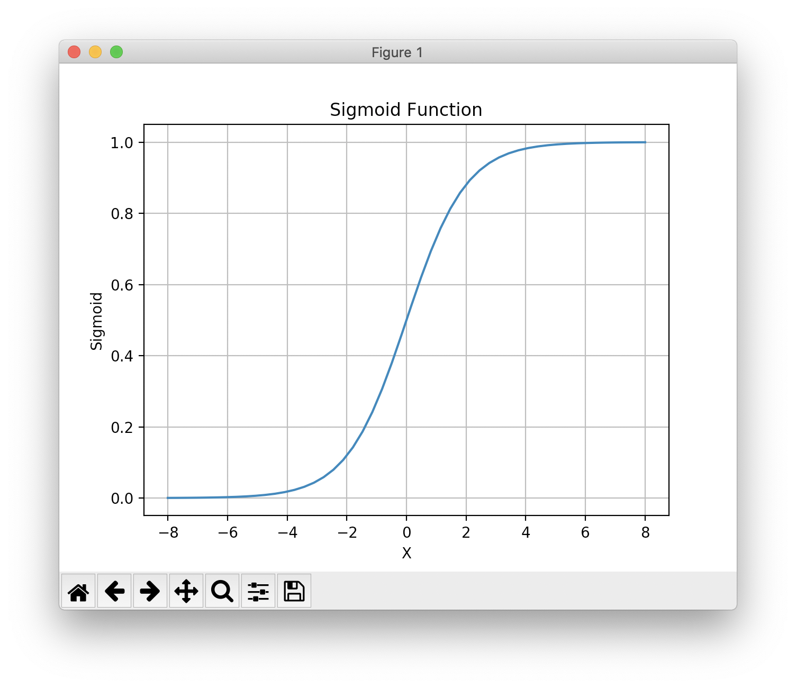
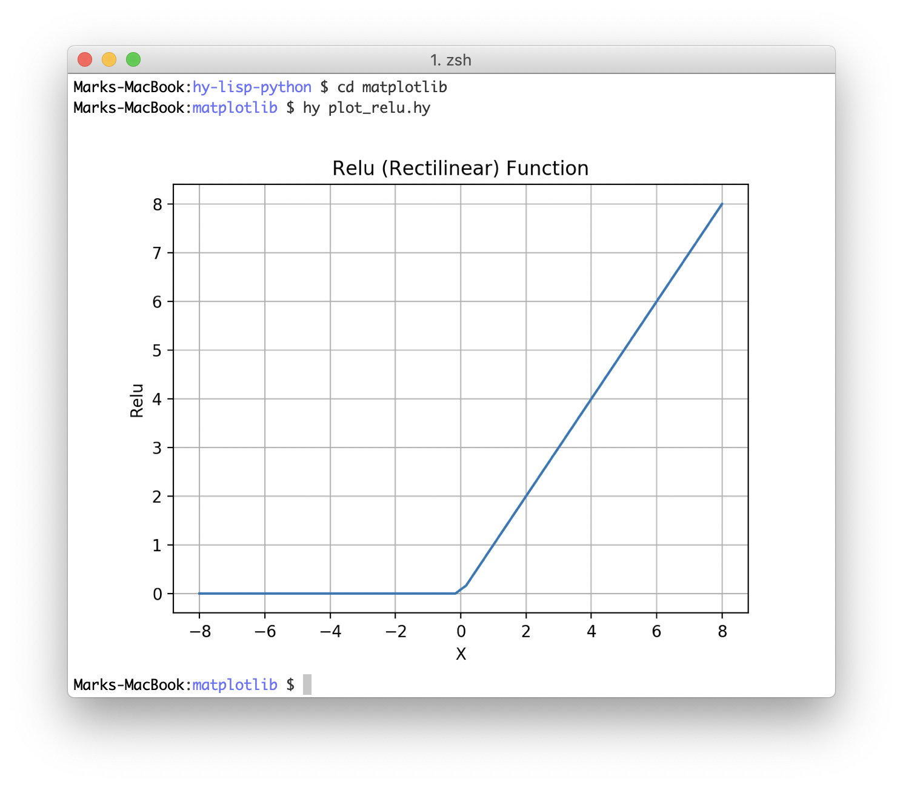
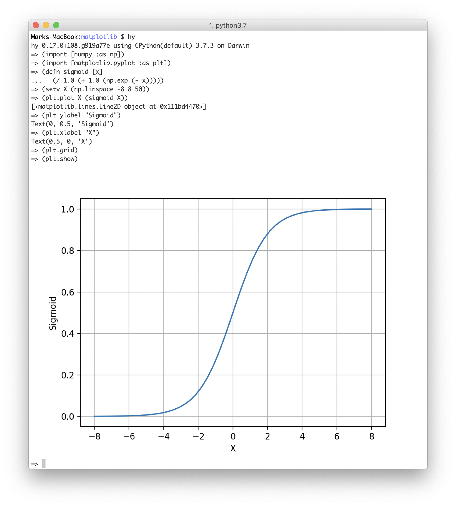

# Introduction to the Hy Language

The [Hy programming language](http://docs.hylang.org/en/stable/) is a Lisp language that inter-operates smoothly with Python. We start with a few interactive examples that I encourage you to experiment with as you read. Then we will look at Hy data types and commonly used built-in functions that are used in the remainder of this book.

I assume that you know at least a little Python and more importantly the Python ecosystem and general tools like **pip**.

Please start by installing Hy in your current Python environment:

{lang="bash",linenos=off}
~~~~~~~~
pip install git+https://github.com/hylang/hy.git
~~~~~~~~

## We Will Often Use the Contributed **let** Macro in Book Example Code

In Scheme, Clojure, and Common Lisp languages the **let** special form is used to define blocks of code with local variables and functions. I will require (or import) the contributed **let** macro, that substitutes for a built-in special form in most examples in this book, but I might not include the **require** in short code listings. Always assume that the following lines start each example:

{lang="hylang",linenos=on}
~~~~~~~~
#!/usr/bin/env hy

(require [hy.contrib.walk [let]])
~~~~~~~~

Line 1 is similar to how we make Python scripts into runnable programs. Here we run **hy** instead of **python**. Line 3 imports the **let** macro. We will occasionally use **let** for code blocks with local variable and function definitions and also for using closures (I will cover closures at the end of this chapter):

{lang="hylang",linenos=on}
~~~~~~~~
#!/usr/bin/env hy

(require [hy.contrib.walk [let]])

(let [x 1]
  (print x)
  (let [x 33]
    (print x)
    (setv x 44)
    (print x))
  (print x))
~~~~~~~~

The output is:

{linenos=off}
~~~~~~~~
1
33
44
1
~~~~~~~~

Notice that setting a new value for **x** in the inner **let** expression does not change the value bound to the variable **x** in the outer **let** expression.

## Using Python Libraries

Using Python libraries like TensorFlow, Keras, BeautifulSoup, etc. are the reason I use the Hy language. Importing Python code and libraries and calling out to Python is simple and here we look at sufficient examples so that you will understand example code that we will look at later.

For example, in the chapter **Responsible Web Scraping** we will use the BeautifulSoup library. We will look at some Python code snippets and the corresponding Hy language versions of these snippets. Let's first look at a Python example that we will then convert to Hy:

{lang="python",linenos=on}
~~~~~~~~
from bs4 import BeautifulSoup

raw_data = '<html><body><a href="http://markwatson.com">Mark</a></body></html>'
soup = BeautifulSoup(raw_data)
a_tags = soup.find_all("a")
print("a tags:", a_tags)
~~~~~~~~

In the following listing notice how we import other code and libraries in Hy. The special form **setv** is used to define variables in a local context. Since the **setv** statements in lines 4, 6, and 7 are used at the top level, they are global in the Python/Hy module named after the root name of the source file.

{lang="hylang",linenos=on}
~~~~~~~~
$ hy
hy 0.18.0 using CPython(default) 3.7.4 on Darwin
=> (import [bs4 [BeautifulSoup]])
=> (setv raw-data "<html><body><a href=\"http://markwatson.com\">Mark</a></body></html>")
=> (setv soup (BeautifulSoup raw-data "lxml"))
=> (setv a (.find-all soup "a"))
=> (print "atags:" a)
atags: [<a href="http://markwatson.com">Mark</a>]
=> (type a)
<class 'bs4.element.ResultSet'>
=> (dir a)
['__add__', '__class__', '__contains__', '__delattr__', '__delitem__', '__dict__', '__dir__', '__doc__', '__eq__', '__format__', '__ge__', '__getattr__', '__getattribute__', '__getitem__', '__gt__', '__hash__', '__iadd__', '__imul__', '__init__', '__init_subclass__', '__iter__', '__le__', '__len__', '__lt__', '__module__', '__mul__', '__ne__', '__new__', '__reduce__', '__reduce_ex__', '__repr__', '__reversed__', '__rmul__', '__setattr__', '__setitem__', '__sizeof__', '__str__', '__subclasshook__', '__weakref__', 'append', 'clear', 'copy', 'count', 'extend', 'index', 'insert', 'pop', 'remove', 'reverse', 'sort', 'source']
~~~~~~~~

Notice in lines 3 and 6 that we can have "-" characters inside of variable and function names (**raw-data** and **find-all** in this case) in the Hy language where we might use "_" underscore characters in Python. Like Python, we can use **type** get get the type of a value and **dir** to see what symbols are available for a object.

## Global vs. Local Variables

Although I don't generally recommend it, sometimes it is convenient to export local variables defined with **setv** or in a **let** macro expansion to be global variables in the context of the current module (that is defined by the current source file). As an example:

{lang="hylang",linenos=on}
~~~~~~~~
Marks-MacBook:deeplearning $ hy
hy 0.17.0+108.g919a77e using CPython(default) 3.7.3 on Darwin
=> (defn foo []
... (global x)
... (setv x 1)
... (print x))
=> (foo)
1
=> x
1
=> 
~~~~~~~~

Before executing function **foo** the global variable **x** is undefined (unless you coincidentally already defined somewhere else). When function **foo** is called, a global variable **x** is defined and then it equal to the value 1.

## Using Python Code in Hy Programs

If there is a Python source file, named for example, *test.py* in the same directory as a Hy language file:

{lang="python",linenos=on}
~~~~~~~~
def factorial (n):
  if n < 2:
    return 1
  return n * factorial(n - 1)
~~~~~~~~

This code will be in a module named **test** because that is the root source code file name. We might import the Python code using the following in Python:

{lang="python",linenos=on}
~~~~~~~~
import test

print(test.factorial(5))
~~~~~~~~

and we can use the following in Hy to import the Python module **test** (defined in *test.py*):

{lang="hylang",linenos=on}
~~~~~~~~
(import test)

(print (test.factorial 5))
~~~~~~~~

Running this interactively in Hy:

{lang="hylang",linenos=on}
~~~~~~~~
$ hy
hy 0.17.0+108.g919a77e using CPython(default) 3.7.3 on Darwin
=> (import test)
=> test
<module 'test' from '/Users/markw/GITHUB/hy-lisp-python/test.py'>
=> (print (test.factorial 5))
120
~~~~~~~~

If we only wanted to import **BeautifulSoup** from the Python BeautifulSoup library **bs4** we can specify this in the **import** form:

{lang="hylang",linenos=on}
~~~~~~~~
(import [bs4 [BeautifulSoup]])
~~~~~~~~

## Using Hy Libraries in Python Programs

There is nothing special about importing and using Hy library code or your own Hy scripts in Python programs. The directory **hy-lisp-python/use_hy_in_python** in the [git repository for this book https://github.com/mark-watson/hy-lisp-python](https://github.com/mark-watson/hy-lisp-python) contains an example Hy script **get_web_page.hy** that is a slightly modified version of code we will explain and use in the later chapter on web scraping and a short Python script **use_hy_stuff.py** that uses a function defined in Hy:

**get_web_page.hy:**

{lang="hylang",linenos=on}
~~~~~~~~
(import argparse os)
(import [urllib.request [Request urlopen]])

(defn get-raw-data-from-web [aUri &optional [anAgent
                                            {"User-Agent" "HyLangBook/1.0"}]]
  (setv req (Request aUri :headers anAgent))
  (setv httpResponse (urlopen req))
  (setv data (.read httpResponse))
  data)

(defn main_hy []
  (print (get-raw-data-from-web "http://markwatson.com")))
~~~~~~~~

We define two functions here. Notice the optional argument **anAgent** defined in lines 4-5 where we provide a default value in case the calling code does not provide a value. In the next Python listing we import the file in the last listing and call the Hy function **main** on line 4 using the Python calling syntax.

Hy is the same as Python once it is compiled to an abstract syntax tree (AST).

**hy-lisp-python/use_in_python:**

{lang="hylang",linenos=on}
~~~~~~~~
import hy
from get_web_page import main_hy

main_hy()
~~~~~~~~

What I want you to understand and develop a feeling for is that Hy and Python are really the same but with a different syntax and that both languages can easily be used side by side.

## Replacing the Python slice (cut) Notation with the Hy Functional Form

In Python we use a special notation for extracting sub-sequences from lists or strings:

{lang="python",linenos=off}
~~~~~~~~
$ python
Python 3.7.3 (default, Mar 27 2019, 16:54:48) 
>>> s = '0123456789'
>>> s[2:4]
'23'
>>> s[-4:]
'6789'
>>> s[-4:-1]
'678'
>>> 
~~~~~~~~

In Hy this would be:

{lang="hylang",linenos=off}
~~~~~~~~
$ hy
hy 0.17.0+108.g919a77e using CPython(default) 3.7.3 on Darwin
=> (setv s "0123456789")
=> (cut s 2 4)
'23'
=> (cut s -4)
'6789'
=> (cut s -4 -1)
'678'
=> 
~~~~~~~~

It also works to use **cut** with **setv** to destructively change a list; for example:

{lang="hylang",linenos=off}
~~~~~~~~
=> (setv x [0 1 2 3 4 5 6 7 8])
=> x
[0, 1, 2, 3, 4, 5, 6, 7, 8]
=> (cut x 2 4)
[2, 3]
=> (setv (cut x 2 4) [22 33])
=> x
[0, 1, 22, 33, 4, 5, 6, 7, 8]
~~~~~~~~

## Iterating Through a List With Index of Each Element

We will use **lfor** as a form of Python list comprehension; for example:

{lang="hylang",linenos=on}
~~~~~~~~
=> (setv sentence "The ball rolled")
=> (lfor i (enumerate sentence) i)
[(0, 'T'), (1, 'h'), (2, 'e'), (3, ' '), (4, 'b'), (5, 'a'), (6, 'l'), (7, 'l'), (8, ' '), (9, 'r'), (10, 'o'), (11, 'l'), (12, 'l'), (13, 'e'), (14, 'd')]
=> (setv vv (lfor i (enumerate sentence) i))
=> vv
[(0, 'T'), (1, 'h'), (2, 'e'), (3, ' '), (4, 'b'), (5, 'a'), (6, 'l'), (7, 'l'), (8, ' '), (9, 'r'), (10, 'o'), (11, 'l'), (12, 'l'), (13, 'e'), (14, 'd')]
=> (for [[a b] vv]
... (print a b))
0 T
1 h
2 e
3  
4 b
5 a
6 l
7 l
8  
9 r
10 o
11 l
12 l
13 e
14 d
=> 
~~~~~~~~

On line 2, the expression **(enumerate sentence)** generates one character at a time from a string. **enumerate** operating on a list will generate one list element at a time.

Line 9 shows an example of *destructuring*: the values in the list **vv** are tuples (tuples are like lists but are immutable, that is, once a tuple is constructed the values it holds can not be changed) with two values. The values in each tuple are copied into binding variables in the list **[a b]**. We could have used the following code instead but it is more verbose:

{lang="hylang",linenos=off}
~~~~~~~~
=> (for [x vv]
    (setv a (first x))
    (setv b (second x))
... (print a b))
0 T
1 h
2 e
3  
4 b
 . . .
13 e
14 d
=> 
~~~~~~~~

## Formatted Output

I suggest using the Python **format** method when you need to format output. In the following repl listing, you can see a few formatting options: insert any Hy data into a string (line 3), print values with a specific width and right justified (in line 5 the width for both values is 15 characters), print values with a specific width and left justified (in line 7), and limiting the number of characters values can be expressed as (in line 9 the object "cat" is expressed as just the first two characters and the value 3.14159 is expressed as just three numbers, the period not counting).

{lang="hylang",linenos=off}
~~~~~~~~
$ hy
hy 0.18.0 using CPython(default) 3.7.4 on Darwin
=> (.format "first: {} second: {}" "cat" 3.14159)
'first: cat second: 3.14159'
=> (.format "first: {:>15} second: {:>15}" "cat" 3.14159)
'first:             cat second:         3.14159'
=> (.format "first: {:15} second: {:15}" "cat" 3.14159)
'first: cat             second:         3.14159'
=> (.format "first: {:.2} second: {:.3}" "cat" 3.14159)
'first: ca second: 3.14'
=> 
~~~~~~~~

Notice the calling **.format** here returns a string value rather than writing to an output stream.

## Importing Libraries from Different Directories on Your Laptop

I usually write applications by first implementing simpler low-level utility libraries that are often not in the same directory path as the application that I am working on. Let's look at a simple example of accessing the library **nlp_lib.hy** in the directory **hy-lisp-python/nlp** from the directory **hy-lisp-python/webscraping**:

{lang="hylang",linenos=on}
~~~~~~~~
Marks-MacBook:hy-lisp-python $ pwd
/Users/markw/GITHUB/hy-lisp-python
Marks-MacBook:hy-lisp-python $ cd webscraping 
Marks-MacBook:webscraping $ hy
hy 0.17.0+108.g919a77e using CPython(default) 3.7.3 on Darwin
=> (import sys)
=> (sys.path.insert 1 "../nlp")
=> (import [nlp-lib [nlp]])
=> (nlp "President George Bush went to Mexico and he had a very good meal")
{'text': 'President George Bush went to Mexico and he had a very good meal', 
  ...
 'entities': [['George Bush', 'PERSON'], ['Mexico', 'GPE']]}
=> (import [coref-nlp-lib [coref-nlp]])
=> (coref-nlp "President George Bush went to Mexico and he had a very good meal")
{'corefs': 'President George Bush went to Mexico and President George Bush had a very good meal',  ...  }}}
=> 
~~~~~~~~

Here I did not install the library **nlp_lib.hy** using Python setuptools (which I don't cover in this book, you can [read the documentation](https://setuptools.readthedocs.io)) as a library on the system. I rely on relative paths between the library directory and the application code that uses the library.

On line 6 I am inserting the library directory into the Python system load path so the import statement on line 8 can find the **nlp-lib** library and on line 13 can find the **coref-nlp-lib** library.

## Using Closures

Function definitions can capture values defined outside of a function and even change the captured value as seen in this example (file **closure_example.hy** in the directory **hy-lisp-python/misc**):

{lang="hylang",linenos=on}
~~~~~~~~
#!/usr/bin/env hy

(require [hy.contrib.walk [let]])

(let [x 1]
  (defn increment []
    (setv x (+ x 1))
    x))

(print (increment))
(print (increment))
(print (increment))
~~~~~~~~

That produces:

{linenos=off}
~~~~~~~~
2
3
4
~~~~~~~~

Using closures is often a good alternative to object oriented programming for maintaining private state that only one or a few functions (that are defined inside the closure) are allowed to access and modify. In the last example the **let** statement could have defined more than one variable with initial values and many functions could have been defined to perform various calculations with the values of these captured variables and/or change the values of captured variables. This effectively hides the variables defined in the **let** statement from code outside of the let statement but the functions are accessible from outside the **let** statement.

## Hy Looks Like Clojure: How Similar Are They?

[Clojure](https://clojure.org/) is a dynamic general purpose Lisp language for the JVM. One of the great Clojure features is support of immutable data (read only after creation) that makes multi-threaded code easier to write and maintain.

Unfortunately, Clojure's immutable  data structures cannot be easily implemented efficiently in Python so the Hy language does  not support immutable data, except for tuples. Otherwise the syntax for defining functions, using maps/hash tables/dictionaries, etc. is similar between the two languages.

The original Hy language developer Paul Tagliamonte was clearly inspired by Clojure.

The book **Serious Python** by Julien Danjou has an entire chapter (chapter 9) on the Python AST (abstract syntax tree), an introduction to Hy, and an interview with Paul Tagliamonte. Recommended!

[This podcast](https://www.pythonpodcast.com/episode-23-hylang-core-developers/) in 2015 interviews Hy developers Paul Tagliamonte, Tuukka Turto, and Morten Linderud. You can see the [current Hy contributer list on github](https://github.com/hylang/hy/graphs/contributors).

## Plotting Data Using the Numpy and the Matplotlib Libraries

Data visualization is a common task when working with numeric data. In a later chapter on Deep Learning we will use two functions, the **relu** and **sigmoid** functions. Here we will use a few simple Hy language scripts to plot these functions.

The Numpy library supports what is called "broadcasting" in Python. In the function **sigmoid** that we define in the following REPL, we can pass either a single floating point number or a Numpy array as an argument. When we pass a Numpy array, then the function **sigmoid** is applied to each element of the Numpy array:

{lang="hylang",linenos=on}
~~~~~~~~
$ hy
hy 0.17.0+108.g919a77e using CPython(default) 3.7.3 on Darwin
=> (import [numpy :as np])
=> (import [matplotlib.pyplot :as plt])
=> 
=> (defn sigmoid [x]
...   (/ 1.0 (+ 1.0 (np.exp (- x)))))
=> (sigmoid 0.2)
0.549833997312478
=> (sigmoid 2)
0.8807970779778823
=> (np.array [-5 -2 0 2 5])
array([-5, -2,  0,  2,  5])
=> (sigmoid (np.array [-5 -2 0 2 5]))
array([0.00669285, 0.11920292, 0.5, 0.88079708, 0.99330715])
=> 
~~~~~~~~

The git repository directory **hy-lisp-python/matplotlib** contains two similar scripts for plotting the **sigmoid** and **relu** functions. Here is the script to plot the **sigmoid** function:

{lang="hylang",linenos=on}
~~~~~~~~
(import [numpy :as np])
(import [matplotlib.pyplot :as plt])

(defn sigmoid [x]
  (/ 1.0 (+ 1.0 (np.exp (- x)))))

(setv X (np.linspace -8 8 50))
(plt.plot X (sigmoid X))
(plt.title "Sigmoid Function")
(plt.ylabel "Sigmoid")
(plt.xlabel "X")
(plt.grid)
(plt.show)
~~~~~~~~

The generated plot looks like this on macOS (Matplotlib is portable and also works on Windows and Linux):

## Bonus Points: Configuration for macOS and ITerm2 for Generating Plots Inline in a Hy REPL and Shell

On the macOS ITerm2 terminal app and on most Linux terminal apps, it is possible to get inline matplotlib plots in a shell (bash, zsh, etc.), in Emacs, etc. This will take some setup work but it is well worth it especially if you work on remote servers via SSH or tmux. Here is the setup for macOS:

      pip3 install itermplot

The add the following to your .profile, .bash_profile, or .zshrc (depending on your shell setup):

      export MPLBACKEND="module://itermplot"

Here we run an example from the last section in a zsh shell (bash, etc. also should work):

The best part of generating inline plots is during interactive REPL-based coding sessions:

If you use a Mac laptop to SSH into a remote Linux server you need to install **itermplot** and set the environment variable **MPLBACKEND** on the remote server.
