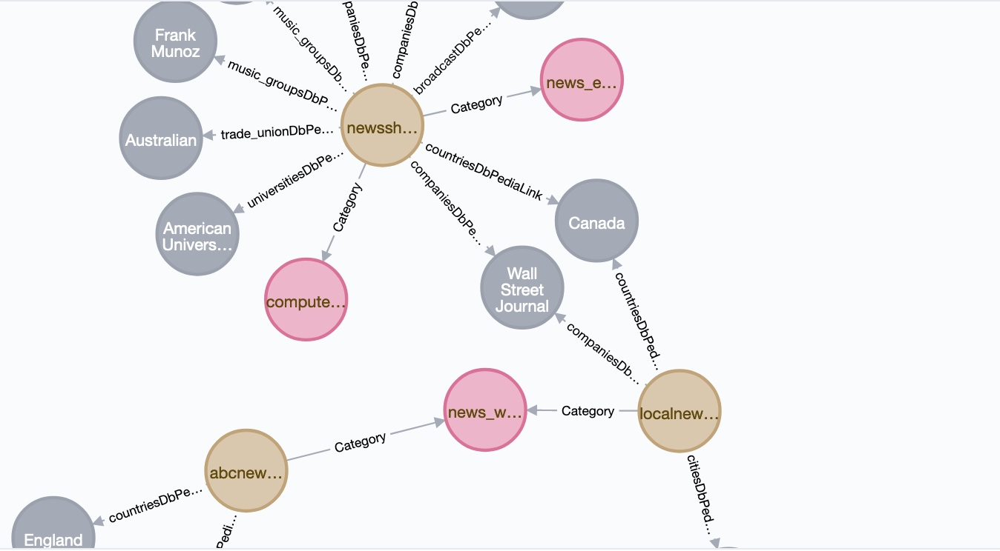
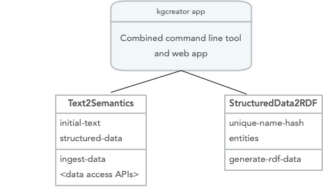

# Knowledge Graphs - Implementing the KGCreator In Hy

A Knowledge Graph, that I often abbreviate as KG, is a graph database using a schema to define types (both objects and relationships between objects) and properties that link property values to objects. The term "Knowledge Graph" is both a general term and also sometimes refers to the specific Knowledge Graph used at Google (which I worked with while working at Google in 2013). Here, we us KG to reference the general technology of storing knowledge in graph databases.

There are two general types of KGs that are widely used in industry and that we will cover here. Property graphs, as used in Neo4J, are general graphs that place no restrictions on the number of links a graph node may have and allow general data structures to be stored as node data and for the property links between nodes. Semantic web data as represented by subject/propert/value RDF triples are more constrained but support powerful logic inferencing to better use data that is implicit in a graph but not explicitely stated (i.e., data is more easily inferred).

We covered RDF data in some detail in the last chapter. Here I will provide a brief introduction to using Neo4J for general graph databases and then we will implement a toolset for converting unstructured text into both RDF and Neo4J data. I believe in both the RDF and the general graph database approaches so I want to provide you with sufficient understanding and example code so that you can start using either or both representations in applications that you write.

Historically Knowledge Graphs used semantic web technology like [Resource Description Framework (RDF)](https://en.wikipedia.org/wiki/Resource_Description_Framework) and [Web Ontology Language (OWL)](https://en.wikipedia.org/wiki/Web_Ontology_Language). I have written two books in 2010 on semantic web technologies and you can get free PDFs for the [Common Lisp version](http://markwatson.com/opencontentdata/book_lisp.pdf) (code is [here](https://github.com/mark-watson/lisp_practical_semantic_web)) and the [Java/Clojure/Scala version](http://markwatson.com/opencontentdata/book_java.pdf) (code is [here](https://github.com/mark-watson/java_practical_semantic_web)). These free books might interest you after working through the material in this chapter.

I have an ongoing personal research project for creating knowledge graphs from various data sources. You can read more at [my KGCreator web site](http://www.kgcreator.com/). I have simplified versions of my KGCreator software implemented in both my [Haskell Book](https://leanpub.com/haskell-cookbook) and in my most recent [Common Lisp book](https://leanpub.com/lovinglisp). The example here is similar to my Common Lisp implementation, except it is implemented in the Hy language.

TBD

# A Brief Introduction to Neo4J Graph Databases

TBD

{width=80%}

Here is a detail view:

{width=50%}

## Design of KGCreator Application

The single application developed here will serve as both a command line tool for converting text file assets to knowledge graph data (RDF and/or Neo4j cypher data) and provides a simple web interface using Flask.

Assuming that you are in the directory for this example, two possible use cases would be:

{lang="hylang",linenos=on}
~~~~~~~~
./KGcreator -i test_data -r out.rdf -c out.cyper
./KGcreator -port 8001
~~~~~~~~
The example on line 1 specifies that all text files in the directory path **test_data** should be processed, generated RDF data should be written to **out.rdf**, and that generated Neo4j cypher data should be written to **out.cypher**. You can leave off either **-r** or **-c** options if you only want cypher or RDF data generated.

The example on line 2 runs a web interface on [http://localhost:8001](http://localhost:8001).

The following figure shows, at a high level, how we will organize the code for this example.

{width=80%}

{lang="hylang",linenos=on}
~~~~~~~~

~~~~~~~~

{width=80%}

{lang="hylang",linenos=on}
~~~~~~~~

~~~~~~~~

{lang="hylang",linenos=on}
~~~~~~~~

~~~~~~~~

{lang="hylang",linenos=on}
~~~~~~~~

~~~~~~~~

