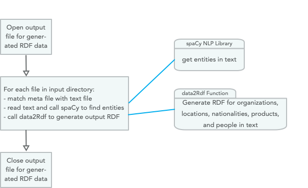

# Knowledge Graphs - Implementing the KGCreator In Hy

A Knowledge Graph, that I often abbreviate as KG, is a graph database using a schema to define types (both objects and relationships between objects) and properties that link property values to objects. The term "Knowledge Graph" is both a general term and also sometimes refers to the specific Knowledge Graph used at Google which I worked with while working at there in 2013. Here, we use KG to reference the general technology of storing knowledge in graph databases.

There are two general types of KGs that are widely used in industry and that we will cover here. Property graphs, as used in Neo4J, are general graphs that place no restrictions on the number of links a graph node may have and allow general data structures to be stored as node data and for the property links between nodes. Semantic web data as represented by subject/property/value RDF triples are more constrained but support powerful logic inferencing to better use data that is implicit in a graph but not explicitly stated (i.e., data is more easily inferred).

We covered RDF data in some detail in the last chapter. Here we will implement a toolset for converting unstructured text into RDF data using a few schema definitions from [schema.org](https://schema.org/). I believe in both the RDF and the general graph database approaches but here we will just use RDF.

Historically Knowledge Graphs used semantic web technology like [Resource Description Framework (RDF)](https://en.wikipedia.org/wiki/Resource_Description_Framework) and [Web Ontology Language (OWL)](https://en.wikipedia.org/wiki/Web_Ontology_Language). I wrote two books in 2010 on semantic web technologies and you can get free PDFs for the [Common Lisp version](http://markwatson.com/opencontentdata/book_lisp.pdf) (code is [here](https://github.com/mark-watson/lisp_practical_semantic_web)) and the [Java/Clojure/Scala version](http://markwatson.com/opencontentdata/book_java.pdf) (code is [here](https://github.com/mark-watson/java_practical_semantic_web)). These free books might interest you after working through the material in this chapter.

I have an ongoing personal research project for creating knowledge graphs from various data sources. You can read more at [my KGCreator web site](http://www.kgcreator.com/). I have simplified versions of my KGCreator software implemented in both my [Haskell Book](https://leanpub.com/haskell-cookbook) and in my most recent [Common Lisp book](https://leanpub.com/lovinglisp). The example here is similar to my Common Lisp implementation, except that it is implemented in the Hy language and I only support generating RDF. The examples in my Haskell and Common Lisp books also generate data for the Neo4J graph database.

TBD

## Design of KGCreator Application

The example application developed here processes input text files in the sub-directory **test_data**. For each file with the extension **.txt** in **test_data**, there should be a matching file with the extension **.meta** that contains the origin URI for the cooresponding text file. The git repo has a few files in **test_data** that you can experiment with or replace with your own data:

{lang="bash",linenos=off}
~~~~~~~~
$ ls test_data 
test1.meta	test1.txt	test2.meta	test2.txt	test3.meta	test3.txt
~~~~~~~~

{width=70%}

Using only the spaCy NLP library that we used earlier and the built in Hy/Python libraries, this example is implemented in just 60 lines of Hy code that is seen in the following three code listings:

{lang="hylang",linenos=on}
~~~~~~~~
#!/usr/bin/env hy

(import [os [scandir]])
(import [os.path [splitext exists]])
(import spacy)

(setv nlp-model (spacy.load "en"))

(defn find-entities-in-text [some-text]
  (defn clean [s]
    (.strip (.replace s "\n" " ")))
  (setv doc (nlp-model some-text))
  (map list (lfor entity doc.ents [(clean entity.text) entity.label_])))
~~~~~~~~

In lines 3 and 4 we import three standard Python utilites we need for finding all files in a directory, checking to see if a file exists, and splitting text into tokens.  In line 7 we load the English language spaCy model and save the value of the model in the variable **nlp-model**. The function find-entities-in-text uses the spaCy English language model to find entities like organizations, people, etc. in text and cleans entity names by removing new line characters and other unnecessary white space (nested function **clean** in lines 10 and 11). We can run a test in a repl:

{lang="hylang",linenos=off}
~~~~~~~~
=> (list (find-entities-in-text "John Smith went to Los Angeles to work at IBM"))
[['John Smith', 'PERSON'], ['Los Angeles', 'GPE'], ['IBM', 'ORG']]
~~~~~~~~

The function **find-entities-in-text** returns a map object so I wrapped the results in a **list** to print out the entities in the test sentence. The entity types used by spaCy were defined in an earlier chapter, here we just use the entity types defined in lines 21-26 in the following listing:

{lang="hylang",linenos=on, number-from=14}
~~~~~~~~
(defn data2Rdf [meta-data entities fout]
  (for [[value abreviation] entities]
    (if (in abreviation e2umap)
      (.write fout (+ "<" meta-data ">\t" (get e2umap abreviation) "\t" "\""
                       value "\"" " .\n")))))

(setv e2umap {
  "ORG" "<https://schema.org/Organization>"
  "LOC" "<https://schema.org/location>"
  "GPE" "<https://schema.org/location>"
  "NORP" "<https://schema.org/nationality>"
  "PRODUCT" "<https://schema.org/Product>"
  "PERSON" "<https://schema.org/Person>"})
~~~~~~~~

In lines 28-39 we open an output file for writing generated RDF data and loop through all text files in the input directory and call the function **process-file** for each text + meta file pair in the input directory:

{lang="hylang",linenos=on, number-from=28}
~~~~~~~~
(defn process-directory [directory-name output-rdf]
  (with [frdf (open output-rdf "w")]
    (with [entries (scandir directory-name)]
      (for [entry entries]
        (setv [_ file-extension] (splitext entry.name))
        (if (= file-extension ".txt")
            (do
              (setv check-file-name (+ (cut entry.path 0 -4) ".meta"))
              (if (exists check-file-name)
                  (process-file entry.path check-file-name frdf)
                  (print "Warning: no .meta file for" entry.path
                         "in directory" directory-name))))))))
~~~~~~~~

{lang="hylang",linenos=on, number-from=40}
~~~~~~~~
(defn process-file [txt-path meta-path frdf]
  
  (defn read-data [text-path meta-path]
    (with [f (open text-path)] (setv t1 (.read f)))
    (with [f (open meta-path)] (setv t2 (.read f)))
    [t1 t2])
  
  (defn modify-entity-names [ename]
    (.replace ename "the " ""))
  
  (setv [txt meta] (read-data txt-path meta-path))
  (setv entities (find-entities-in-text txt))
  (setv entities ;; only operate on a few entity types
        (lfor [e t] entities
              :if (in t ["NORP" "ORG" "PRODUCT" "GPE" "PERSON" "LOC"])
              [(modify-entity-names e) t]))
  (data2Rdf meta entities frdf))

(process-directory "test_data" "output.rdf")
~~~~~~~~

Let's look at some of the generated RDF for the text files in the input test directory (most output is not shown):

{lang="hylang",linenos=off}
~~~~~~~~
<https://newsshop.com/may/a1023.html>
  <https://schema.org/nationality>	"European" .
<https://newsshop.com/may/a1023.html>
  <https://schema.org/nationality>	"Portuguese" .
<https://newsshop.com/may/a1023.html>
  <https://schema.org/Organization>	"Banco Espirito Santo SA" .
<https://newsshop.com/may/a1023.html>
  <https://schema.org/Person>	"John Evans" .
<https://newsshop.com/may/a1023.html>
  <https://schema.org/Person>	"Jill Hines" .
<https://newsshop.com/may/a1023.html>
  <https://schema.org/Organization>	"Banco Espirito" .
<https://newsshop.com/may/a1023.html>
  <https://schema.org/Organization>	"The Wall Street Journal" .
<https://newsshop.com/may/a1023.html>
  <https://schema.org/Organization>	"Banco Espirito Santo's" .
<https://newsshop.com/may/a1023.html>
  <https://schema.org/Person>	"Ben Cole" .
<https://newsshop.com/may/a1023.html>
  <https://schema.org/Organization>	"IBM" .
<https://newsshop.com/may/a1023.html>
  <https://schema.org/location>	"Canada" .
<https://newsshop.com/may/a1023.html>
  <https://schema.org/Organization>	"Australian Broadcasting Corporation" .
<https://newsshop.com/may/a1023.html>
  <https://schema.org/Person>	"Frank Smith" .
<https://newsshop.com/may/a1023.html>
  <https://schema.org/Organization>	"Australian Writers Guild" .
<https://newsshop.com/may/a1023.html>
  <https://schema.org/Organization>	"American University" .
<https://localnews.com/june/z902.html>
  <https://schema.org/Organization>	"The Wall Street Journal" .
<https://localnews.com/june/z902.html>
  <https://schema.org/location>	"Mexico" .
<https://localnews.com/june/z902.html>
  <https://schema.org/location>	"Canada" .
<https://localnews.com/june/z902.html>
  <https://schema.org/Person>	"Bill Clinton" .
<https://localnews.com/june/z902.html>
  <https://schema.org/Organization>	"IBM" .
<https://localnews.com/june/z902.html>
  <https://schema.org/Organization>	"Microsoft" .
<https://abcnews.go.com/US/tornadoes-threaten-oklahoma-texas/story?id=63146361>
  <https://schema.org/Person>	"Jane Deerborn" .
<https://abcnews.go.com/US/tornadoes-threaten-oklahoma-texas/story?id=63146361>
  <https://schema.org/location>	"Texas" .
~~~~~~~~

{lang="hylang",linenos=off}
~~~~~~~~

~~~~~~~~

