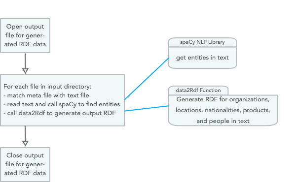
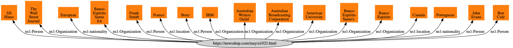
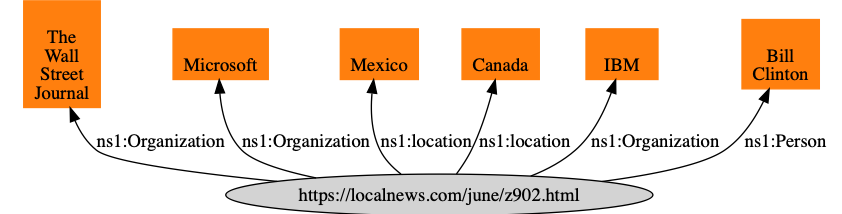
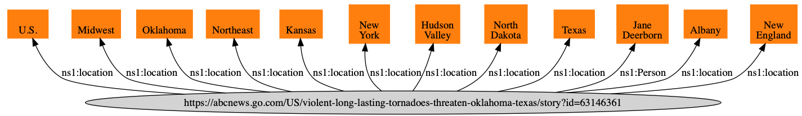
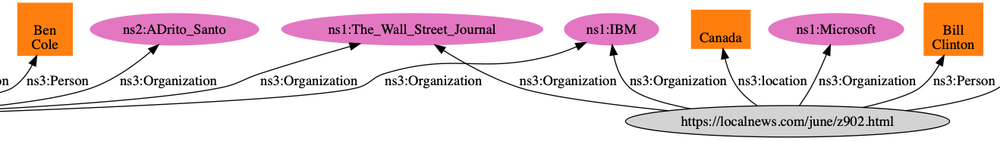

# Knowledge Graph Creator

A Knowledge Graph, that I often abbreviate as **KG**, is a graph database using a schema to define types (both objects and relationships between objects) and properties that link property values to objects. The term "Knowledge Graph" is both a general term and also sometimes refers to the specific Knowledge Graph used at Google which I worked with while working there in 2013. Here, we use KG to reference the general technology of storing knowledge in graph databases.

The application we develop here, the Knowledge Graph Creator (which I often refer to as KGCreator) is a utility that I use to generate small Knowledge Graphs from input text.

Knowledge engineering and knowledge representation are disciplines that started in the 1980s and are still both current research topics and used in industry. I view linked data, the semantic web, and KGs as extensions of this earlier work.

We base our work here on RDF. There is a general type of KGs that are also widely used in industry and that we will not cover here: property graphs, as used in Neo4J. Property graphs are general graphs that place no restrictions on the number of links a graph node may have and allow general data structures to be stored as node data and for the property links between nodes. Property links can have attributes, like nodes in the graph.

Semantic web data as represented by subject/property/value RDF triples are more constrained than property graphs but support powerful logic inferencing to better use data that is implicit in a graph but not explicitly stated (i.e., data is more easily inferred).

We covered RDF data in some detail in the last chapter. Here we will implement a toolset for converting unstructured text into RDF data using a few schema definitions from [schema.org](https://schema.org/). I believe in both the RDF and the general graph database approaches but here we will just use RDF.

Historically Knowledge Graphs used semantic web technology like [Resource Description Framework (RDF)](https://en.wikipedia.org/wiki/Resource_Description_Framework) and [Web Ontology Language (OWL)](https://en.wikipedia.org/wiki/Web_Ontology_Language). I wrote two books in 2010 on semantic web technologies and you can get free PDFs for the [Common Lisp version](http://markwatson.com/opencontentdata/book_lisp.pdf) (code is [here](https://github.com/mark-watson/lisp_practical_semantic_web)) and the [Java/Clojure/Scala version](http://markwatson.com/opencontentdata/book_java.pdf) (code is [here](https://github.com/mark-watson/java_practical_semantic_web)). These free books might interest you after working through the material in this chapter.

I have an ongoing personal research project for creating knowledge graphs from various data sources. You can read more at [my KGCreator web site](http://www.kgcreator.com/). I have simplified versions of my KGCreator software implemented in both my [Haskell Book](https://leanpub.com/haskell-cookbook) and in my most recent [Common Lisp book](https://leanpub.com/lovinglisp). The example here is similar to my Common Lisp implementation, except that it is implemented in the Hy language and I only support generating RDF. The examples in my Haskell and Common Lisp books also generate data for the Neo4J graph database.

What is a KG? It is a modern way to organize and access structured data and integrate data and metadata with other automated systems.

A Knowledge Graph is different from just a graph database containing graph data. The difference is that a KG will in general use Schemas, Taxonomy's and Ontology's that define the allowed types and structure of data and allowed relationships.

There is also an executable aspect of KGs since their primary use may be to support other systems in an organization.

## Recommended Industrial Use of Knowledge Graphs

Who needs a KG? How do you get started?

If people in your organization are spending much time doing general web search, it might be a signal that you should maintain your organization's curated knowledge in a human searchable and software accessible way. A possible application is an internal search engine that mixes public web search APIs with search for knowledge used internally inside your organization.

Here are a few use cases:

- At Google we used their Knowledge Graph for researching new internal systems that were built on their standard Knowledge Graph, with new schemas and data added.
- Digital transformations: start by using a KG to hold metadata for current data in already existing databases. A KG of metadata can provide you with a virtual data lake. It is common to build a large data lake and then have staff not be able to find data. Don't try to do everything at once.
- Capture and preserve senior human expertise. The act of building an Ontology for in-house knowledge helps to understand how to organize data and provides people with a common vocabulary to discuss and model business processes.
- KYC (Know Your Customer) applications using data from many diverse data sources.
- Take advantage of expertise in a domain (e.g., healthcare or financial services) to build a Taxonomy and Ontology to use to organize available data. For most domains, there are standard existing Schemas, Taxonomy's and Ontology's that can be identified and used as-is or extended for your organization.

To get started:

- Start small with just one use case.
- Design a Schema that identifies object types and relationships
- Write some acceptance test cases that you want a prototype to be able to serve as a baseline to develop against.
- Avoid having too many stakeholders in early prototype projects — try to choose stakeholders based on potential stakeholders' initial enthusiasm.

A good way to start is to identify a single problem, determine the best data sources to use, define an Ontology that is just sufficient to solve the current problem and build a prototype "vertical slice" application. Lessons learned with a quick prototype will inform you on what was valuable and what to put effort into when expanding your KG. Start small and don't try to build a huge system without taking many small development and evaluation steps.

What about KGs for small organizations? Small companies have less development resources but starting small and implementing a system that models the key data relationships, customer relationships, etc., does not require excessive resources. Just capturing where data comes from and who is responsible for maintaining important data sources can be valuable.

What about KGs for individuals? Given the effort involved in building custom KGs, one possible individual use case is developing KGs for commercial sale.

The application that we develop next is one way to quickly bootstrap a new KG by populating it with automatically generated RDF than can be manually curated by removing statements and adding new statements as appropriate.

## Design of KGCreator Application

The example application developed here processes input text files in the sub-directory **test_data**. For each file with the extension **.txt** in **test_data**, there should be a matching file with the extension **.meta** that contains the origin URI for the corresponding text file. The git repository for this book has a few files in **test_data** that you can experiment with or replace with your own data:

{lang="bash",linenos=off}
~~~~~~~~
$ ls test_data 
test1.meta test1.txt test2.meta test2.txt test3.meta test3.txt
~~~~~~~~

The *.txt files contain plain text for analysis and the *.meta files contain the original web source URI for the corresponding *.txt files. Using the spaCy library and Python/Hy's standard libraries for file access, the KGCreator is simple to implement. Here is the overall design of this example:

{width=70%}

We will develop two versions of the Knowledge Graph Creator. The first generates RDF that uses string values for the object part of generated RDF statements. The second implementation attempts to resolve these string values to DBPedia URIs.

Using only the spaCy NLP library that we used earlier and the built in Hy/Python libraries, this first example (uses strings a object values) is implemented in just 58 lines of Hy code that is seen in the following three code listings:

{lang="hylang",linenos=on}
~~~~~~~~
#!/usr/bin/env hy

(import os [scandir])
(import os.path [splitext exists])
(import spacy)

(setv nlp-model (spacy.load "en"))

(defn find-entities-in-text [some-text]
  (defn clean [s]
    (.strip (.replace s "\n" " ")))
  (setv doc (nlp-model some-text))
  (map list (lfor entity doc.ents [(clean entity.text) entity.label_])))
~~~~~~~~

In lines 3 and 4 we import three standard Python utilities we need for finding all files in a directory, checking to see if a file exists, and splitting text into tokens.  In line 7 we load the English language spaCy model and save the value of the model in the variable **nlp-model**. The function find-entities-in-text uses the spaCy English language model to find entities like organizations, people, etc., in text and cleans entity names by removing new line characters and other unnecessary white space (nested function **clean** in lines 10 and 11). We can run a test in a REPL:

{lang="hylang",linenos=off}
~~~~~~~~
=> (list (find-entities-in-text "John Smith went to Los Angeles to work at IBM"))
[['John Smith', 'PERSON'], ['Los Angeles', 'GPE'], ['IBM', 'ORG']]
~~~~~~~~

The function **find-entities-in-text** returns a map object so I wrapped the results in a **list** to print out the entities in the test sentence. The entity types used by spaCy were defined in an earlier chapter, here we just use the entity types defined in lines 21-26 in the following listing:

{lang="hylang",linenos=on, number-from=14}
~~~~~~~~
(defn data2Rdf [meta-data entities fout]
  (for [[value abbreviation] entities]
    (if (in abbreviation e2umap)
      (.write fout (+ "<" meta-data ">\t" (get e2umap abbreviation) "\t" "\""
                       value "\"" " .\n")))))

(setv e2umap {
  "ORG" "<https://schema.org/Organization>"
  "LOC" "<https://schema.org/location>"
  "GPE" "<https://schema.org/location>"
  "NORP" "<https://schema.org/nationality>"
  "PRODUCT" "<https://schema.org/Product>"
  "PERSON" "<https://schema.org/Person>"})
~~~~~~~~

In lines 28-39 we open an output file for writing generated RDF data and loop through all text files in the input directory and call the function **process-file** for each text + meta file pair in the input directory:

{lang="hylang",linenos=on, number-from=28}
~~~~~~~~
(defn process-directory [directory-name output-rdf]
  (with [frdf (open output-rdf "w")]
    (with [entries (scandir directory-name)]
      (for [entry entries]
        (setv [_ file-extension] (splitext entry.name))
        (if (= file-extension ".txt")
            (do
              (setv check-file-name (+ (cut entry.path 0 -4) ".meta"))
              (if (exists check-file-name)
                  (process-file entry.path check-file-name frdf)
                  (print "Warning: no .meta file for" entry.path
                         "in directory" directory-name))))))))
~~~~~~~~

{lang="hylang",linenos=on, number-from=40}
~~~~~~~~
(defn process-file [txt-path meta-path frdf]
  
  (defn read-data [text-path meta-path]
    (with [f (open text-path)] (setv t1 (.read f)))
    (with [f (open meta-path)] (setv t2 (.read f)))
    [t1 t2])
  
  (defn modify-entity-names [ename]
    (.replace ename "the " ""))
  
  (setv [txt meta] (read-data txt-path meta-path))
  (setv entities (find-entities-in-text txt))
  (setv entities ;; only operate on a few entity types
        (lfor [e t] entities
              :if (in t ["NORP" "ORG" "PRODUCT" "GPE" "PERSON" "LOC"])
              [(modify-entity-names e) t]))
  (data2Rdf meta entities frdf))

(process-directory "test_data" "output.rdf")
~~~~~~~~

Run using:

{lang="hylang",linenos=on, number-from=40}
~~~~~~~~
$ uv sync
$ uv run hy kgcreator.hy
~~~~~~~~

We will look at generated output, problems with it, and how to fix these problems in the next section.

## Problems with using Literal Values in RDF

Using the Hy script in the last section, let's look at some of the generated RDF for the text files in the input test directory (most output is not shown). In each triple the first item, the subject, is the URI of the data source, the second item in each statement is a URI representing a relationship (or property), and the third item is a literal string value:

{lang="hylang",linenos=off}
~~~~~~~~
<https://newsshop.com/may/a1023.html>
  <https://schema.org/nationality>	"Portuguese" .
<https://newsshop.com/may/a1023.html>
  <https://schema.org/Organization>	"Banco Espirito Santo SA" .
<https://newsshop.com/may/a1023.html>
  <https://schema.org/Person>	      "John Evans" .
<https://newsshop.com/may/a1023.html>
  <https://schema.org/Organization>	"Banco Espirito" .
<https://newsshop.com/may/a1023.html>
  <https://schema.org/Organization>	"The Wall Street Journal" .
<https://newsshop.com/may/a1023.html>
  <https://schema.org/Organization>	"IBM" .
<https://newsshop.com/may/a1023.html>
  <https://schema.org/location>	"Canada" .
<https://newsshop.com/may/a1023.html>
  <https://schema.org/Organization>	"Australian Broadcasting Corporation" .
<https://newsshop.com/may/a1023.html>
  <https://schema.org/Person>	"Frank Smith" .
<https://newsshop.com/may/a1023.html>
  <https://schema.org/Organization>	"Australian Writers Guild" .
<https://newsshop.com/may/a1023.html>
  <https://schema.org/Organization>	"American University" .
<https://localnews.com/june/z902.html>
  <https://schema.org/Organization>	"The Wall Street Journal" .
<https://localnews.com/june/z902.html>
  <https://schema.org/location>	"Mexico" .
<https://localnews.com/june/z902.html>
  <https://schema.org/location>	"Canada" .
<https://localnews.com/june/z902.html>
  <https://schema.org/Person>	"Bill Clinton" .
<https://localnews.com/june/z902.html>
  <https://schema.org/Organization>	"IBM" .
<https://localnews.com/june/z902.html>
  <https://schema.org/Organization>	"Microsoft" .
<https://abcnews.go.com/US/violent-long-lasting-tornadoes-threaten-oklahoma-texas/story?id=63146361>
  <https://schema.org/Person>	"Jane Deerborn" .
<https://abcnews.go.com/US/violent-long-lasting-tornadoes-threaten-oklahoma-texas/story?id=63146361>
  <https://schema.org/location>	"Texas" .
~~~~~~~~

Let's visualize the results in a bash shell:

{lang="bash",linenos=off}
~~~~~~~~
$ git clone https://github.com/fatestigma/ontology-visualization
$ cd ontology-visualization
$ chmod +x ontology_viz.py
$ ./ontology_viz.py -o test.dot output.rdf  -O ontology.ttl
$ # copy the file output.rdf from examples repo directory hy-lisp-python/kgcreator
$ dot -Tpng -o test.png test.dot
$ open test.png
~~~~~~~~

Edited to fit on the page, the output looks like:

{width: "90%"}

{width: "90%"}

{width: "90%"}

Because we used literal values, notice how for example the node for the entity **IBM** is not shared and thus a software agent using this RDF data cannot, for example, infer relationships between two news sources that both have articles about IBM. We will work on a solution to this problem in the next section.

## Revisiting This Example Using URIs Instead of Literal Values

Note that in the figure in the previous section that nodes for literal values (e.g., for "IBM") are not shared. In this section we will copy the file **kgcreator.hy** to **kgcreator_uri.hy** add a few additions to map string literal values for entity names to [http://dbpedia.org](http://dbpedia.org) URIs by individually searching Google using the pattern "DBPedia 'entity name'" and defining a new map **v2umap** for mapping literal values to DBPedia URIs.

Note: In a production system (not a book example), I would use [https://www.wikidata.org database download](https://www.wikidata.org/wiki/Wikidata:Database_download) to download all of WikiData (which includes DBPedia data) and use a fuzzy text matching to find WikiData URIs for string literals. The compressed WikiData JSON data file is about 50 GB. Here we will manually find DBPedia for entity names that are in the example data.

In **kgcreator_uri.hy** we add a map **v2umap** for selected entity literal names to DBPedia URIs that I manually created using a web search on the DBPedia domain:

{lang="hylang",linenos=off}
~~~~~~~~
(setv v2umap { ;; object literal value to URI mapping
  "IBM" "<http://dbpedia.org/page/IBM>"
  "The Wall Street Journal" "<http://dbpedia.org/page/The_Wall_Street_Journal>"
  "Banco Espirito" "<http://dbpedia.org/page/Banco_Esp%C3%ADrito_Santo>"
  "Australian Broadcasting Corporation"
  "http://dbpedia.org/page/Australian_Broadcasting_Corporation"
  "Australian Writers Guild"
  "http://dbpedia.org/page/Australian_Broadcasting_Corporation"
  "Microsoft" "http://dbpedia.org/page/Microsoft"})
~~~~~~~~

We also make a change in the function **data2Rdf** to use the map **v2umap**:

{lang="hylang",linenos=off}
~~~~~~~~
(defn data2Rdf [meta-data entities fout]
  (for [[value abbreviation] entities]
    (setv a-literal (+ "\"" value "\""))
    (if (in value v2umap) (setv a-literal (get v2umap value)))
    (if (in abbreviation e2umap)
      (.write fout (+ "<" meta-data ">\t" (get e2umap abbreviation)
                      "\t" a-literal " .\n")))))
~~~~~~~~

Here is some of the generated RDF that has changed:

{linenos=off}
~~~~~~~~
<https://newsshop.com/may/a1023.html>
  <https://schema.org/Organization>
  <http://dbpedia.org/page/IBM> .
<https://newsshop.com/may/a1023.html>
  <https://schema.org/Organization>
  <http://dbpedia.org/page/Banco_Esp%C3%ADrito_Santo> .
~~~~~~~~

Run using:

{lang="hylang",linenos=on, number-from=40}
~~~~~~~~
$ uv sync
$ uv run hy kgcreator_uri.hy
~~~~~~~~

Now when we visualize generated RDF, we share nodes for The Wall Street Journal and IBM:

{width=90%}

While literal values sometimes are useful in generated RDF, using literals for the values in RDF triples prevents types of queries and inference that can be performed on the data.

## Wrap-up

In the field of Artificial Intelligence there are two topics that get me the most excited and I have been fortunate to be paid to work on both: Deep Learning and Knowledge Graphs. Here we have just touched the surface for creating data for Knowledge Graphs but I hope that between this chapter and the material on RDF in the chapter **Datastores** that you have enough information and experience playing with the examples to get started prototyping a Knowledge Graph in your organization. My advice is to "start small" by picking a problem that your organization has that can be solved by not moving data around, but rather, by creating a custom Knowledge Graph for metadata for existing information in your organization.
