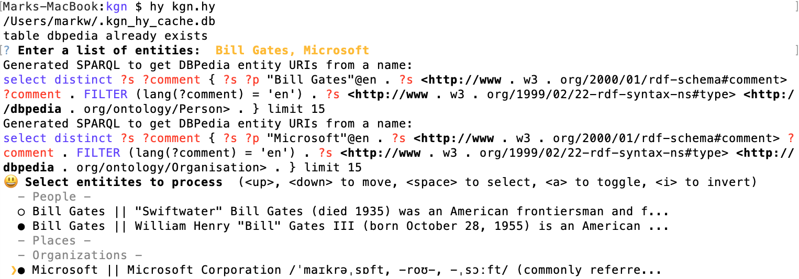
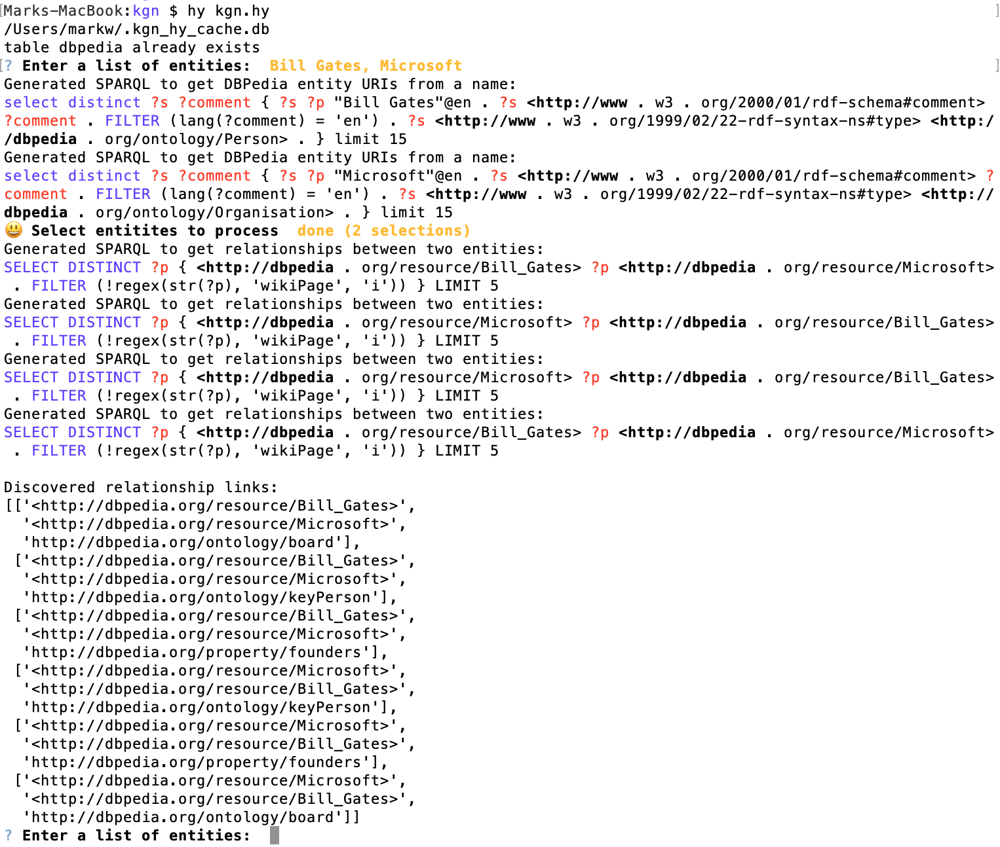
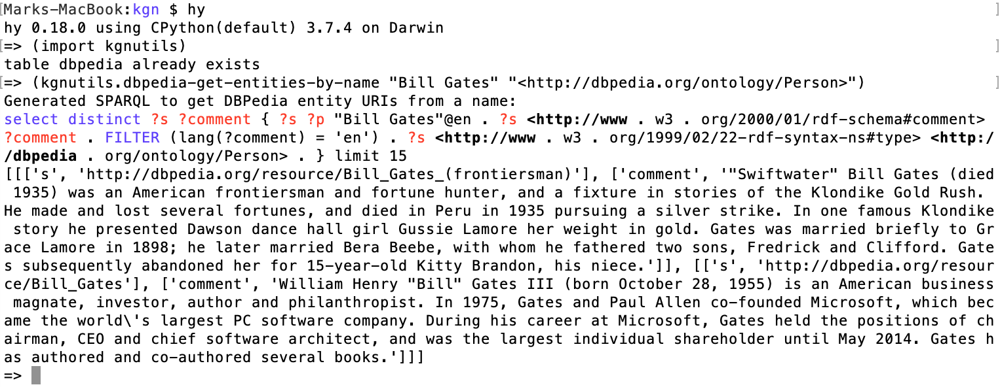

# Knowledge Graph Navigator {#kgn}

The Knowledge Graph Navigator (which I will often refer to as KGN) is a tool for processing a set of entity names and automatically exploring the public Knowledge Graph [DBPedia](http://dbpedia.org) using SPARQL queries. I wrote KGN in Common Lisp for my own use to automate some things I used to do manually when exploring Knowledge Graphs, and later thought that KGN might be useful also for educational purposes. KGN uses NLP code developed in earlier chapters and we will reuse that code with a short review of using the APIs.

Please note that the example is a simplified version that I first wrote in Common Lisp and is also an example in my book [Loving Common Lisp, or the Savvy Programmer's Secret Weapon](https://leanpub.com/lovinglisp) that you can read for free online. If you are interested you can see [screen shots of the Common Lisp version here](http://www.knowledgegraphnavigator.com/screen/).

The following two screen shots show the text based user interface for this example. This example application asks the user for a list of entity names and uses SPARQL queries to discover potential matches in DBPedia. We use the python library [PyInquirer](https://github.com/CITGuru/PyInquirer) for requesting entity names and then to show the user a list of matches from DBPedia. The following screen shot shows these steps:

{width=92%}

To select the entities of interest, the user uses a space character to select or deselect an entity and the return (or enter) key to accept the list selections.

After the user selects entities from the list, the list disappears. The next screen shot shows the output from this example after the user finishes selecting entities of interest:

{width=92%}

The code for this application is in the directory **kgn**. You will need to install the following Python library that supports console/text user interfaces:

{lang="bash",linenos=off}
~~~~~~~~
pip install PyInquirer
~~~~~~~~

You will also need the **spacy** library and language model that we used in the earlier chapter on natural language processing. If you have not already done so, install these requirements:

{lang="bash",linenos=off}
~~~~~~~~
pip install spacy
python -m spacy download en_core_web_sm
~~~~~~~~

After listing the generated SPARQL for finding information for the entities in the query, KGN searches for relationships between these entities. These discovered relationships can be seen at the end of the last screen shot. Please note that this step makes SPARQL queries on **O(n^2)** where **n** is the number of entities. Local caching of SPARQL queries to DBPedia helps make processing many entities possible.

Every time KGN makes a SPARQL query web service call to DBPedia the query and response are cached in a SQLite database in **~/.kgn_hy_cache.db** which can greatly speed up the program, especially in development mode when testing a set of queries. This caching also takes some load off of the public DBPedia endpoint, which is a polite thing to do.

## Review of NLP Utilities Used in Application

We covered NLP in a previous chapter, so the following is just a quick review. The NLP code we use is near the top of the file **kgn.hy**:

{lang="hylang",linenos=off}
~~~~~~~~
(import spacy)

(setv nlp-model (spacy.load "en"))

(defn entities-in-text [s]
  (setv doc (nlp-model s))
  (setv ret {})
  (for
    [[ename etype] (lfor entity doc.ents [entity.text entity.label_])]   
    (if (in etype ret)
        (setv (get ret etype) (+ (get ret etype) [ename]))
        (assoc ret etype [ename])))
  ret)
~~~~~~~~

Here is an example use of this function:

{linenos=off}
~~~~~~~~
=> (kgn.entities-in-text "Bill Gates, Microsoft, Seattle")
{'PERSON': ['Bill Gates'], 'ORG': ['Microsoft'], 'GPE': ['Seattle']}
~~~~~~~~

The entity type "GPE" indicates that the entity is some type of location.

### SPARQL Utilities

We will use the caching code from the last section and also the standard Python library **requests** to access the DBPedia servers. The following code is found in the file **sparql.hy** and also provides support for using both DBPedia and WikiData. We only use DBPedia in this chapter but when you start incorporating SPARQL queries into applications that you write, you will also probably want to use WikiData.

The function **do-query-helper** contains generic code for SPARQL queries and is used in functions **wikidata-sparql** and **dbpedia-sparql**:

{lang="hylang",linenos=off}
~~~~~~~~
(import json)
(import requests)

(setv wikidata-endpoint "https://query.wikidata.org/bigdata/namespace/wdq/sparql")
(setv dbpedia-endpoint "https://dbpedia.org/sparql")

(defn do-query-helper [endpoint query]
  ;; Construct a request
  (setv params { "query" query "format" "json"})
        
  ;; Call the API
  (setv response (requests.get endpoint :params params))
        
  (setv json-data (response.json))
        
  (setv vars (get (get json-data "head") "vars"))
        
  (setv results (get json-data "results"))
        
  (if (in "bindings" results)
    (do
      (setv bindings (get results "bindings"))
      (setv qr
            (lfor binding bindings
                (lfor var vars
                   [var (get (get binding var) "value")])))
      qr)
    []))

(defn wikidata-sparql [query]
  (do-query-helper wikidata-endpoint query))

(defn dbpedia-sparql [query]
  (do-query-helper dbpedia-endpoint query))
~~~~~~~~
          
Here is an example query (manually formatted for page width):

{lang="hylang",linenos=off}
~~~~~~~~
$ hy
=> (import sparql)
=> (sparql.dbpedia-sparql
     "select ?s ?p ?o { ?s ?p ?o } limit 1")
[[['s', 'http://www.openlinksw.com/virtrdf-data-formats#default-iid'],
  ['p', 'http://www.w3.org/1999/02/22-rdf-syntax-ns#type'],
  ['o', 'http://www.openlinksw.com/schemas/virtrdf#QuadMapFormat']]]
=> 
~~~~~~~~

This is a wild-card SPARQL query that will match any of the 9.5 billion RDF triples in DBPedia and return just one result.
        
This caching layer greatly speeds up my own personal use of KGN. Without caching, queries that contain many entity references simply take too long to run.

## Utilities to Colorize SPARQL and Generated Output

When I first had the basic functionality of KGN working, I was disappointed by how the application looked as normal text. Every editor and IDE I use colorizes text in an appropriate way so I used standard ANSI terminal escape sequences to implement color hilting SPARQL queries.

The code in the following listing is in the file **colorize.hy**.

{lang="hylang",linenos=off}
~~~~~~~~
(require [hy.contrib.walk [let]])
(import [io [StringIO]])

;; Utilities to add ANSI terminal escape sequences to colorize text.
;; note: the following 5 functions return string values that then need to
;;       be printed.

(defn blue [s] (.format "{}{}{}" "\033[94m" s "\033[0m"))
(defn red [s] (.format "{}{}{}" "\033[91m" s "\033[0m"))
(defn green [s] (.format "{}{}{}" "\033[92m" s "\033[0m"))
(defn pink [s] (.format "{}{}{}" "\033[95m" s "\033[0m"))
(defn bold [s] (.format "{}{}{}" "\033[1m" s "\033[0m"))

(defn tokenize-keep-uris [s]
  (.split s))

(defn colorize-sparql [s]
  (setv tokens
        (tokenize-keep-uris
          (.replace (.replace s "{" " { ") "}" " } ")))
  (setv ret (StringIO)) ;; ret is an output stream for a string buffer
  (for [token tokens]
    (when (> (len token) 0)
        (if (= (get token 0) "?")
            (.write ret (red token))
            (if (in
                  token
                  ["where" "select" "distinct" "option" "filter"
                    "FILTER" "OPTION" "DISTINCT" "SELECT" "WHERE"])
                (.write ret (blue token))
                (if (= (get token 0) "<")
                    (.write ret (bold token))
                    (.write ret token)))))
    (when (not (= token "?"))
        (.write ret " ")))
  (.seek ret 0)
  (.read ret))
~~~~~~~~

You have seen colorized SPARQL in the two screen shots at the beginning of this chapter.

## Text Utilities for Queries and Results

The application low level utility functions are in the file **kgn-utils.hy**. The function **dbpedia-get-entities-by-name** requires two arguments:

- The name of an entity to search for.
- A URI representing the entity type that we are looking for.

We embed a SPARQL query that has placeholders for the entity name and type. The filter expression specifies that we only want triple results with comment values in the English language by using **(lang(?comment) = 'en')**:

{lang="hylang",linenos=on}
~~~~~~~~
#!/usr/bin/env hy

(import sparql [dbpedia-sparql])
(import colorize [colorize-sparql])

(import pprint [pprint])

(defn dbpedia-get-entities-by-name [name dbpedia-type]
  (setv sparql
        (.format "select distinct ?s ?comment {{ ?s ?p \"{}\"@en . ?s <http://www.w3.org/2000/01/rdf-schema#comment>  ?comment  . FILTER  (lang(?comment) = 'en') . ?s <http://www.w3.org/1999/02/22-rdf-syntax-ns#type> {} . }} limit 15" name dbpedia-type))
  (print "Generated SPARQL to get DBPedia entity URIs from a name:")
  (print (colorize-sparql sparql))
  (dbpedia-sparql sparql))

;;(pprint (dbpedia-get-entities-by-name "Bill Gates" "<http://dbpedia.org/ontology/Person>"))

(defn first [a-list]
  (get a-list 0))

(defn second [a-list]
  (get a-list 1))
~~~~~~~~

Here is an example:

{width=92%}

## Finishing the Main Function for KGN

We already looked at the NLP code near the beginning of the file **kgn.hy**. Let's look at the remainder of the implementation.

We need a dictionary (or hash table) to convert **spaCy** entity type names to DBPedia type URIs:

{lang="hylang",linenos=on}
~~~~~~~~
(setv entity-type-to-type-uri
      {"PERSON" "<http://dbpedia.org/ontology/Person>"
       "GPE" "<http://dbpedia.org/ontology/Place>"
       "ORG" "<http://dbpedia.org/ontology/Organisation>"
       })
~~~~~~~~
   
When we get entity results from DBPedia, the comments describing entities can be a few paragraphs of text. We want to shorten the comments so they fit in a single line of the entity selection list that we have seen earlier. The following code defines a comment shortening function and also a global variable that we will use to store the entity URIs for each shortened comment:

{lang="hylang",linenos=on}
~~~~~~~~
(setv short-comment-to-uri {})

(defn shorten-comment [comment uri]
  (setv sc (+ (cut comment 0 70) "..."))
  (assoc short-comment-to-uri sc uri)
  sc)
~~~~~~~~

In line 5, we use the function **assoc** to add a key and value pair to an existing dictionary **short-comment-to-uri**.

Finally, let's look at the main application loop. In line 4 we are using the function **get-query** (defined in file **textui.hy**) to get a list of entity names from the user. In line 7 we use the function **entities-in-text** that we saw earlier to map text to entity types and names. In the nested loops in lines 13-26 we build one line descriptions of people, place, and organizations that we will use to show the user a menu for selecting entities found in DBPedia from the original query. We are giving the use a chance to select only the discovered entities that they are interested in.

In lines 33-35 we are converting the shortened comment strings the user selected back to DBPedia entity URIs. Finally in line 36 we use the function **entity-results->relationship-links** to find relationships between the user selected entities.

{lang="hylang",linenos=on}
~~~~~~~~
(defn kgn []
  (while
    True
    (setv query (get-query))
    (when (or (= query "quit") (= query "q"))
        (break))
    (setv elist (entities-in-text query))
    (setv people-found-on-dbpedia [])
    (setv places-found-on-dbpedia [])
    (setv organizations-found-on-dbpedia [])
    (global short-comment-to-uri)
    (setv short-comment-to-uri {})
    (for [key elist]
      (setv type-uri (get entity-type-to-type-uri key))
      (for [name (get elist key)]
        (setv dbp (dbpedia-get-entities-by-name name type-uri))
        (for [d dbp]
          (setv short-comment (shorten-comment (second (second d)) (second (first d))))
          (when (= key "PERSON")
              (.extend people-found-on-dbpedia [(+ name  " || " short-comment)]))
          (when (= key "GPE")
              (.extend places-found-on-dbpedia [(+ name  " || " short-comment)]))
          (when (= key "ORG")
              (.extend organizations-found-on-dbpedia [(+ name  " || " short-comment)])))))
    (setv user-selected-entities
          (select-entities
            people-found-on-dbpedia
            places-found-on-dbpedia
            organizations-found-on-dbpedia))
    (setv uri-list [])
    (for [entity (get user-selected-entities "entities")]
      (setv short-comment (cut entity (+ 4 (.index entity " || ")) (len entity)))
      (.extend uri-list [(get short-comment-to-uri short-comment)]))
    (setv relation-data (entity-results->relationship-links uri-list))
    (print "\nDiscovered relationship links:")
    (pprint relation-data)))
~~~~~~~~

If you have not already done so, I hope you experiment running this example application. The first time you specify an entity name expect some delay while DBPedia is accessed. Thereafter the cache will make the application more responsive when you use the same name again in a different query.

## Wrap-up

If you enjoyed running and experimenting with this example and want to modify it for your own projects then I hope that I provided a sufficient road map for you to do so.

I got the idea for the KGN application because I was spending quite a bit of time manually setting up SPARQL queries for DBPedia and other public sources like WikiData, and I wanted to experiment with partially automating this exploration process.