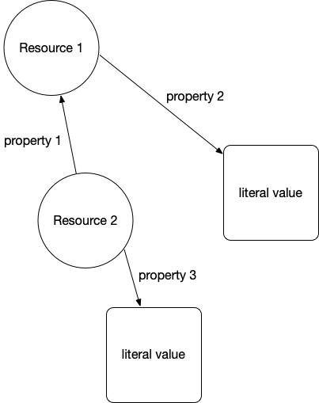
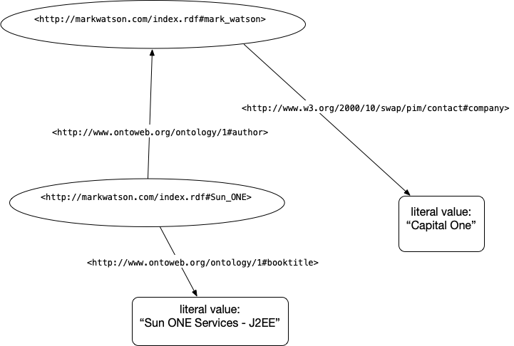

# Linked Data, the Semantic Web, and Knowledge Graphs

Tim Berners Lee, James Hendler, and Ora Lassila wrote in 2001 an article for Scientific American where they introduced the term Semantic Web. Here I do not capitalize semantic web and use the similar term linked data somewhat interchangeably with semantic web. Most work using these technologies now is building corporate Knowledge Graphs. I worked at Google with their Knowledge Graph in 2013 and I worked with the Knowledge Graph team at Olive AI during 2020-2021.

In ths chapter we will only be using the Hy REPL in the directory **hy-lisp-python-book/source_code_for_examples/rdf**:

```
$ cd hy-lisp-python-book/source_code_for_examples/rdf
$ uv sync
$ uv run hy
Hy 1.1.0 (Business Hugs) using CPython(main) 3.12.0 on Darwin
=>
```

In the same way that the web allows links between related web pages, linked data supports linking associated data on the web together. I view linked data as a relatively simple way to specify relationships between data sources on the web while the semantic web has a much larger vision: the semantic web has the potential to be the entirety of human knowledge represented as data on the web in a form that software agents can work with to answer questions, perform research, and to infer new data from existing data.

While the "web" describes information for human readers, the semantic web is meant to provide structured data for ingestion by software agents. This distinction will be clear as we compare WikiPedia, made for human readers, with DBPedia which uses the info boxes on WikiPedia topics to automatically extract RDF data describing WikiPedia topics. Let's look at the WikiPedia topic for the town I live in, Sedona Arizona, and show how the info box on the English version of the [WikiPedia topic page for Sedona https://en.wikipedia.org/wiki/Sedona,_Arizona](https://en.wikipedia.org/wiki/Sedona,_Arizona) maps to the [DBPedia page http://dbpedia.org/page/Sedona,_Arizona](http://dbpedia.org/page/Sedona,_Arizona). Please open both of these WikiPedia and DBPedia URIs in two browser tabs and keep them open for reference.

I assume that the format of the WikiPedia page is familiar so let's look at the DBPedia page for Sedona that in human readable form shows the RDF statements with Sedona Arizona as the subject. RDF is used to model and represent data. RDF is defined by three values so an instance of an RDF statement is called a *triple* with three parts:

- subject: a URI (also referred to as a "Resource")
- property: a URI (also referred to as a "Resource")
- value: a URI (also referred to as a "Resource") or a literal value (like a string)

The subject for each Sedona related triple is the above URI for the DBPedia human readable page. The subject and property references in an RDF triple will almost always be a URI that can ground an entity to information on the web. The human readable page for Sedona lists several properties and the values of these properties. One of the properties is "dbo:areaCode" where "dbo" is a name space reference (in this case for a [DatatypeProperty](http://www.w3.org/2002/07/owl#DatatypeProperty)).

The following two figures show an abstract representation of linked data and then a sample of linked data with actual web URIs for resources and properties:

{width=40%}


{width=75%}


We saw a SPARQL Query (SPARQL for RDF data is similar to SQL for relational database queries) in the last chapter. Let's look at another example using the RDF in the last figure:

        select ?v where {  <http://markwatson.com/index.rdf#Sun_ONE>
                           <http://www.ontoweb.org/ontology/1#booktitle>
                           ?v }

This query should return the result "Sun ONE Services - J2EE". If you wanted to query for all URI resources that are books with the literal value of their titles, then you can use:

        select ?s ?v where {  ?s
                              <http://www.ontoweb.org/ontology/1#booktitle>
                              ?v }


Note that **?s** and **?v** are arbitrary query variable names, here standing for "subject" and "value". You can use more descriptive variable names like:

        select ?bookURI ?bookTitle where 
            { ?bookURI
              <http://www.ontoweb.org/ontology/1#booktitle>
              ?bookTitle }


We will be diving a little deeper into RDF examples in the next chapter when we write a tool for generating RDF data from raw text input.  For now I want you to understand the idea of RDF statements represented as triples, that web URIs represent things, properties, and sometimes values, and that URIs can be followed manually (often called "dereferencing") to see what they reference in human readable form.

## Understanding the Resource Description Framework (RDF)

Text data on the web has some structure in the form of HTML elements like headers, page titles, anchor links, etc. but this structure is too imprecise for general use by software agents. RDF is a method for encoding structured data in a more precise way.

We used the RDF data on my web site in the last chapter to introduce the "plumbing" of using the **rdflib** Python library to access, manipulate, and query RDF data.


## Resource Namespaces Provided in rdflib

The following standard namespaces are predefined in **rdflib**:

- RDF       [https://www.w3.org/TR/rdf-syntax-grammar/](https://www.w3.org/TR/rdf-syntax-grammar/)
- RDFS      [https://www.w3.org/TR/rdf-schema/](https://www.w3.org/TR/rdf-schema/)
- OWL       [http://www.w3.org/2002/07/owl#](http://www.w3.org/2002/07/owl#)
- XSD       [http://www.w3.org/2001/XMLSchema#](http://www.w3.org/2001/XMLSchema#)
- FOAF      [http://xmlns.com/foaf/0.1/](http://xmlns.com/foaf/0.1/)
- SKOS      [http://www.w3.org/2004/02/skos/core#](http://www.w3.org/2004/02/skos/core#)
- DOAP      [http://usefulinc.com/ns/doap#](http://usefulinc.com/ns/doap#)
- DC        [http://purl.org/dc/elements/1.1/](http://purl.org/dc/elements/1.1/)
- DCTERMS   [http://purl.org/dc/terms/](http://purl.org/dc/terms/)
- VOID      [http://rdfs.org/ns/void#](http://rdfs.org/ns/void#)

Let's look into the Friend of a Friend (FOAF) namespace. Click on the above link for FOAF [http://xmlns.com/foaf/0.1/](http://xmlns.com/foaf/0.1/) and find the definitions for the FOAF Core:

        Agent
        Person
        name
        title
        img
        depiction (depicts)
        familyName
        givenName
        knows
        based_near
        age
        made (maker)
        primaryTopic (primaryTopicOf)
        Project
        Organization
        Group
        member
        Document
        Image

and for the Social Web:

    nick
    mbox
    homepage
    weblog
    openid
    jabberID
    mbox_sha1sum
    interest
    topic_interest
    topic (page)
    workplaceHomepage
    workInfoHomepage
    schoolHomepage
    publications
    currentProject
    pastProject
    account
    OnlineAccount
    accountName
    accountServiceHomepage
    PersonalProfileDocument
    tipjar
    sha1
    thumbnail
    logo

You now have seen a few common Schemas for RDF data. Another Schema that is widely used for annotating web sites, that we won't need for our examples here, is [schema.org](https://schema.org). Let's now use a Hy REPL session to explore namespaces and programatically create RDF using **rdflib**:

{lang="hylang",linenos=on}
~~~~~~~~
Marks-MacBook:database $ uv run hy
Hy 1.1.0 (Business Hugs) using CPython(main) 3.12.0 on Darwin
=> (import rdflib.namespace [FOAF])
=> FOAF
Namespace('http://xmlns.com/foaf/0.1/')
=> FOAF.name
rdflib.term.URIRef('http://xmlns.com/foaf/0.1/name')
=> FOAF.title
rdflib.term.URIRef('http://xmlns.com/foaf/0.1/title')
=> (import rdflib)
=> (setv graph (rdflib.Graph))
=> (setv mark (rdflib.BNode))
=> (graph.bind "foaf" FOAF)
=> (import rdflib [RDF])
=> (graph.add [mark RDF.type FOAF.Person])
=> (graph.add [mark FOAF.nick (rdflib.Literal "Mark" :lang "en")])
=> (graph.add [mark FOAF.name (rdflib.Literal "Mark Watson" :lang "en")])
=> (for [node graph] (print node))
(rdflib.term.BNode('N21c7fa7385b545eb8a7e3821b7cb5'), rdflib.term.URIRef('http://www.w3.org/1999/02/22-rdf-syntax-ns#type'), rdflib.term.URIRef('http://xmlns.com/foaf/0.1/Person'))
(rdflib.term.BNode('N21c7fa7385b545eb8a7e3821b7cb5'), rdflib.term.URIRef('http://xmlns.com/foaf/0.1/name'), rdflib.term.Literal('Mark Watson', lang='en'))
(rdflib.term.BNode('N21c7fa7385b545eb8a7e3821b7cb5'), rdflib.term.URIRef('http://xmlns.com/foaf/0.1/nick'), rdflib.term.Literal('Mark', lang='en'))
=> (graph.serialize :format "pretty-xml")
b'<?xml version="1.0" encoding="utf-8"?>
<rdf:RDF
    xmlns:foaf="http://xmlns.com/foaf/0.1/"
    xmlns:rdf="http://www.w3.org/1999/02/22-rdf-syntax-ns#"
>
  <foaf:Person rdf:nodeID="N21c7fa7385b545eb8a7e3821b75b9cb5">
    <foaf:name xml:lang="en">Mark Watson</foaf:name>
    <foaf:nick xml:lang="en">Mark</foaf:nick>
  </foaf:Person>
</rdf:RDF>\n'
=> (graph.serialize :format "turtle")
@prefix foaf: <http://xmlns.com/foaf/0.1/> .
@prefix rdf: <http://www.w3.org/1999/02/22-rdf-syntax-ns#> .
@prefix rdfs: <http://www.w3.org/2000/01/rdf-schema#> .
@prefix xml: <http://www.w3.org/XML/1998/namespace> .
@prefix xsd: <http://www.w3.org/2001/XMLSchema#> .

[] a foaf:Person ;
     foaf:name "Mark Watson"@en ;
     foaf:nick "Mark"@en .

=> (graph.serialize :format "nt")
_:N21c7fa7385b545eb8a7e3821b75b9cb5
   <http://www.w3.org/1999/02/22-rdf-syntax-ns#type>
   <http://xmlns.com/foaf/0.1/Person> .
_:N21c7fa7385b545eb8a7e3821b75b9cb5 <http://xmlns.com/foaf/0.1/name> "Mark Watson"@en .
_:N21c7fa7385b545eb8a7e3821b75b9cb5 <http://xmlns.com/foaf/0.1/nick> "Mark"@en .
=> 
~~~~~~~~


## Understanding the SPARQL Query Language

For the purposes of the material in this book, the two sample SPARQL queries here and in the last chapter are sufficient for you to get started using **rdflib** with arbitrary RDF data sources and simple queries.

The Apache Foundation has a [good introduction to SPARQL](https://jena.apache.org/tutorials/sparql.html) that I refer you to for more information.

## Wrapping the Python **rdflib** Library

I hope that I have provided you with enough motivation to explore RDF data sources and consider the use of linked data/semantic web technologies for your projects.

If I depend on a library, regardless of the programming language, I like to keep an up-to-date copy of the source code ready at hand. There is sometimes no substitute for having library code available to read.
