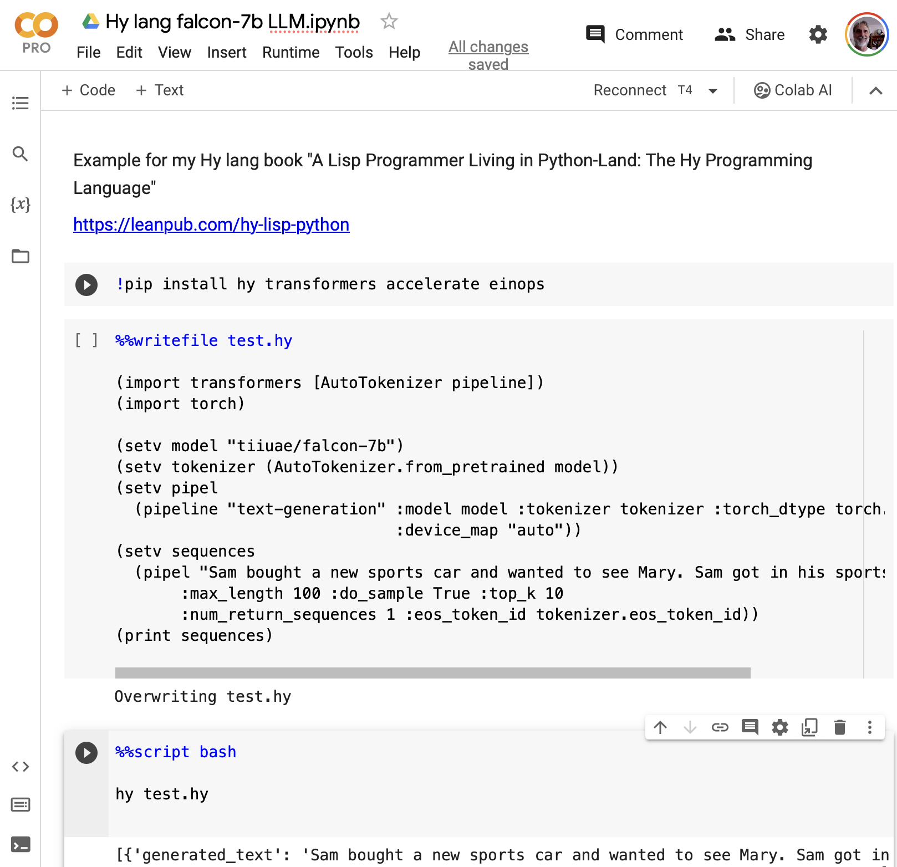

# Large Language Models Experiments Using Google Colab

In addition to using OpenAI, Cohere, LLM APIs, etc. you can also run smaller LLMs locally on your laptop if you have enough memory (and optionally a good GPU). When I experiment with self-hosted LLMs I usually run them in the cloud using either Google Colab or a leased GPU server from Lambda Labs.

We will use the Hugging Face tiiuae/falcon-7b model. You can read the [Hugging Face documentation for the tiiuae/falcon-7b model](https://huggingface.co/tiiuae/falcon-7b-instruct).

Google Colab directly supports only the Python and R languages. We can use Hy by using the **%%writefile test.hy** script magic to write the contents of a cell to a local file, in this case Hy language source code. For interactive development we will use the script magic **%%script bash** to run **hy test.hy** because this will use the same process when we re-evaluate the notebook cell. If we would run our Hy script using **!hy test.hy** then each time we evaluate the cell we would get a fresh Linux process, so the previous caching of model files, etc. would be repeated.

Here we use the [Colab notebook](https://colab.research.google.com/drive/1pHBa-8TaajsBEiZ-dEydeL1FyLn5nvnW?usp=sharing) that is shown here:



If you have a laptop that can run this example, you can also run it locally by installing the dependencies:

    pip install hy transformers accelerate einops

Here is the code example:

```hylang
(import transformers [AutoTokenizer pipeline])
(import torch)

(setv model "tiiuae/falcon-7b")
(setv tokenizer (AutoTokenizer.from_pretrained model))
(setv pipel
  (pipeline "text-generation" :model model :tokenizer tokenizer
                              :torch_dtype torch.bfloat16
                              :device_map "auto"))
(setv sequences
  (pipel "Sam bought a new sports car and wanted to see Mary. Sam got in his sports car and"
       :max_length 100 :do_sample True :top_k 10
       :num_return_sequences 1 :eos_token_id tokenizer.eos_token_id))
(print sequences)
```

The generated text varies for each run. Here is example output:

```
Sam bought a new sports car and wanted to see Mary. Sam got in his sports car and drove the 20 miles to Mary’s house. The weather was perfect and the road was nice and smooth. It didn’t take long to get there and Sam had a lot of time to relax on his way. The car was a lot of fun to drive because it had all kinds of new safety features, and Sam really felt in control of his sports car.
```

As I write this chapter in September 2023, more small LLM models are being released that can run on laptops. If you use M1 or M2 Macs and you have at least 16G of shared memory, it is now also easier to run LLMs locally. Macs with 64G or more shared memory are very capable of both local self-hosted fine tuning and inference. While it is certainly simpler to use APIs from OpenAI and other vendors there are privacy and control advantages to running self-hosted models.