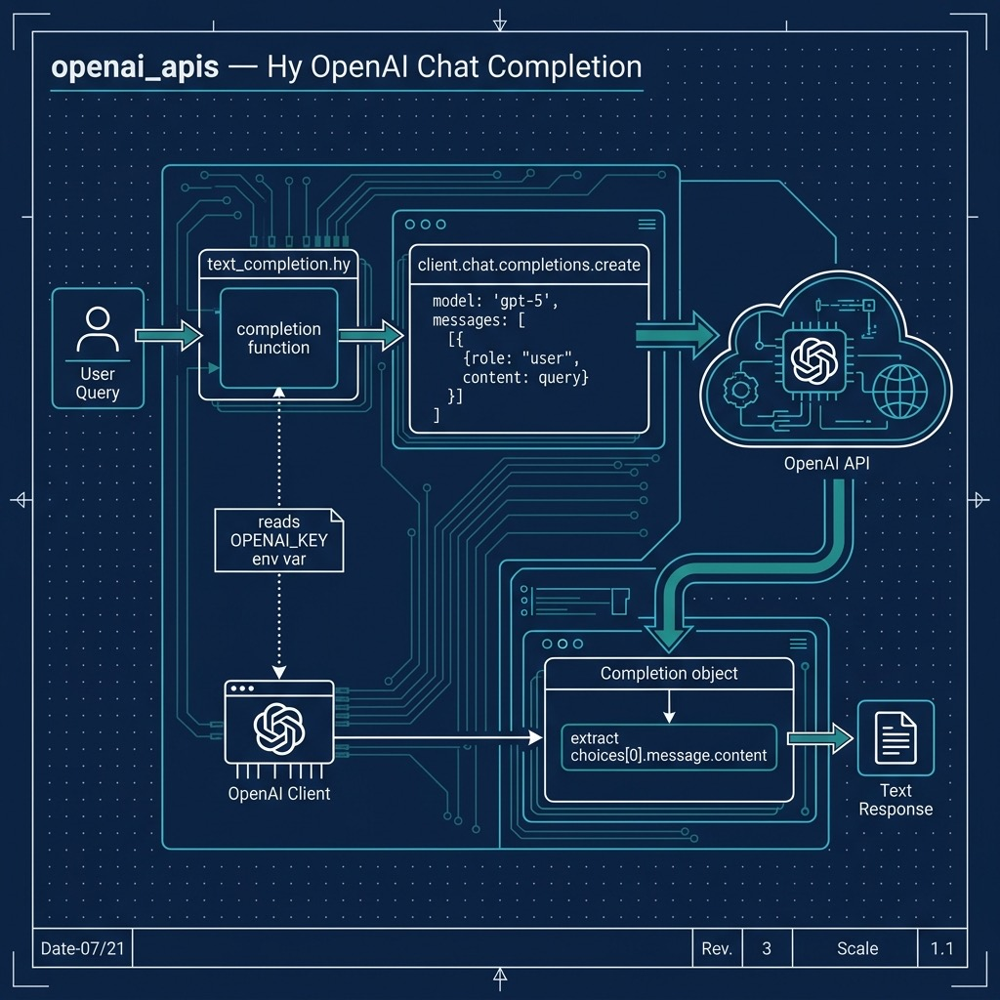

# Using OpenAI GPT

I use frequently use the OpenAI APIs in my work. In this chapter we use the GPT-5 API since it works well for our examples.

{width: "80%"}


## OpenAI Text Completion API

OpenAI GPT (Generative Pre-trained Transformer) models like gpt-4o, gpt-4o-mini, and gpt-5 are advanced language processing models developed by OpenAI. There are three general classes of OpenAI API services:

- GPT which performs a variety of natural language tasks.
- Codex which translates natural language to code.
- DALL·E which creates and edits original images.

GPT-5 is capable of generating human-like text, completing tasks such as language translation, summarization, and question answering, and much more.

Overall, the OpenAI APIs provide a powerful and easy-to-use tool for developers to integrate advanced language processing capabilities into their applications, and can be a game changer for developers looking to add natural language processing capabilities to their projects.

The following examples are derived from the official set of cookbook examples at [https://github.com/openai/openai-cookbook](https://github.com/openai/openai-cookbook). The first example calls the OpenAI gpt-4o-mini Completion API with a sample of input text and the model completes the text.

Here is a listing or the source file **openai/text_completion.hy**:


```hy
(import os)
(import openai)

(setv openai.api_key (os.environ.get "OPENAI_KEY"))

(setv client (openai.OpenAI))

(defn completion [query] ; return a Completion object
  (setv
    completion
    (client.chat.completions.create
      :model "gpt-5"
      :messages
      [{"role" "user"
        "content" query
        }]))
  (print completion)
  (get completion.choices 0))

(setv x (completion "how to fix leaky faucet?"))

(print x.message.content)
```

Every time you run this example you get different output. Here is one example run (output truncated for brevity):

```text
Fixing a leaky faucet can be a straightforward process, and you can often do it yourself with some basic tools. Here’s a step-by-step guide:

### Tools and Materials Needed:
- Adjustable wrench
- Screwdriver (flathead or Phillips, depending on your faucet)
- Replacement parts (O-rings, washers, or cartridge, depending on your faucet type)
- Plumber's grease
- Towel or rag

### Steps to Fix a Leaky Faucet:

1. **Turn Off the Water Supply**:
   - Look for shut-off valves under the sink and turn them clockwise to close. If there are no shut-off valves, you may need to turn off the main water supply to your home.

2. **Drain the Faucet**:
   - Open the faucet to let any remaining water drain out.

etc.
```

## Optional Practice Problems

- **System Persona**: Modify [text_completion.hy](file:///Users/markwatson/GITHUB/hy-lisp-python-book/source_code_for_examples/openai_apis/text_completion.hy) to accept a system prompt instructing the model to adopt a specific persona (for example, a Lisp developer explaining Python code). You will need to add a message dictionary with the `"role" "system"` at the beginning of the `:messages` list in the [completion](file:///Users/markwatson/GITHUB/hy-lisp-python-book/source_code_for_examples/openai_apis/text_completion.hy#L8) function.
- **Configurable Parameters**: Update the [completion](file:///Users/markwatson/GITHUB/hy-lisp-python-book/source_code_for_examples/openai_apis/text_completion.hy#L8) function signature to support optional parameters or keyword arguments like `temperature` (default `0.7`) and `max-tokens` (default `150`), and pass them to the underlying call to `client.chat.completions.create`.
- **Interactive Chat Loop**: Implement an interactive loop in [text_completion.hy](file:///Users/markwatson/GITHUB/hy-lisp-python-book/source_code_for_examples/openai_apis/text_completion.hy) using `while` and `input` so that the user can ask questions iteratively from the terminal until they type "exit" or "quit".
