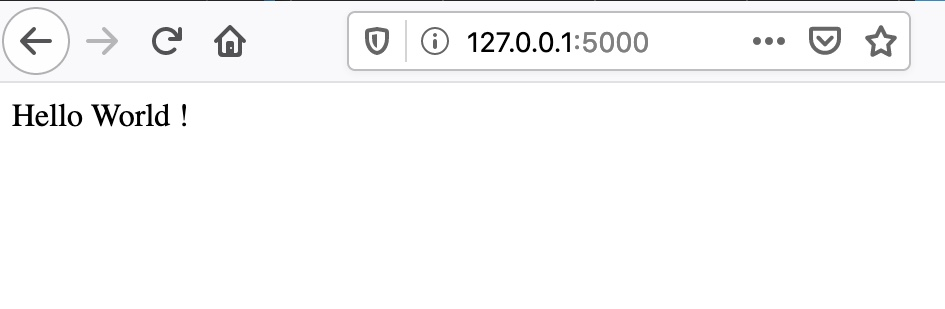
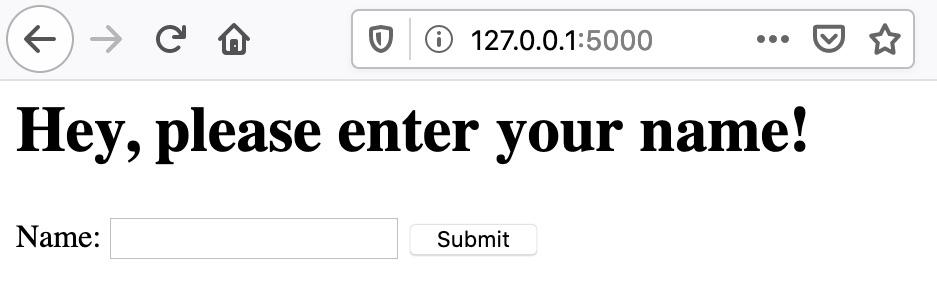
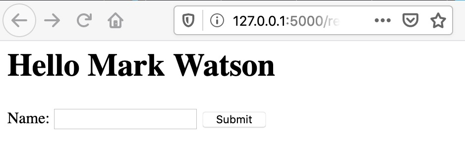

# Writing Web Applications

Python has good libraries and frameworks for building web applications and here we will use the **Flask** library and framework "under the hood" and write two simple Hy Language web applications. We will start with a simple "Hello World" example in Python, see how to reformulate it in Hy, and then proceed with more complex examples that will show how to use HTML generating templates, sessions, and cookies to store user data for the next time they visit your web site. In a later chapter we will cover use of the SQLite and PostgreSQL databases which are commonly used to persist data for users in web applications. This pattern involves letting a user login and store a unique token for the user in a web browser cookie. In principle, you can do the same with web browser cookies but if a user visits your web site with a different browser or device then they will not have access to the data stored in cookies on a previous visit.

I like lightweight web frameworks. In Ruby I use Sinatra, in Haskell I use Spock, and when I built Java web apps I liked lightweight tools like JSP. Flask is simple but capable and using it from Hy is productive and fun. In addition to using lightweight frameworks I like to deploy web apps in the simplest way possible. We will close this chapter by discussing how to use the Heroku and Google Cloud Platform AppEngine platforms.

## Getting Started With Flask: Using Python Decorators in Hy

You will need to install Flask using:

{linenos=off}
~~~~~~~~
pip install flask
~~~~~~~~

We will use the Hy macro **with-decorator** to replace Python code with annotations. Here the decorator **@app.route** is used to map a URI pattern with a Python callback function. In the following case we define the behavior when the index page of a web app is accessed:

{lang="python",linenos=on}
~~~~~~~~
from flask import Flask

@app.route('/')
  def index():
     return "Hello World !")

app.run()
~~~~~~~~

I first used Flask with the Hy language after seeing a post of code from HN user "volent", seen in the file **flask_test.hy** in the directory **hy-lisp-python/webapp** that is functionally equivalent to the above Python code snippet:

{lang="hylang",linenos=on}
~~~~~~~~
#!/usr/bin/env hy

;; snippet by HN user volent and modifed for
;; Hy 0.26.0 with a comment from stackoverflow user plokstele:

(import flask [Flask])
(setv app (Flask "Flask test"))
(defn [(.route app "/")] index [] "Hello World !")
(app.run)
~~~~~~~~

I liked this example and after experimenting with the code, I then started using Hy and Flask. Please try running this example to make sure you are setup properly with Flask:

{lang="bash",linenos=off}
~~~~~~~~
(base) Marks-MacBook:webapp $ ./flask_test.hy 
 * Serving Flask app "Flask test" (lazy loading)
 * Environment: production
   WARNING: This is a development server. Do not use it in a production deployment.
   Use a production WSGI server instead.
 * Debug mode: off
 * Running on http://127.0.0.1:5000/ (Press CTRL+C to quit)
~~~~~~~~

Open [http://127.0.0.1:5000/](http://127.0.0.1:5000/) in your web browser:

{width: "80%"}

## Using Jinja2 Templates To Generate HTML

[Jinja2](https://pypi.org/project/Jinja2/) is a templating system that allows HTML markup to be supplemented with Python variable references and simple Python loops, etc. The values of application variables can be stored in a context and the HTML template has the variables values substituted with current values before returning a HTML response to the user's web browser.

By default Jinja2 templates are stored in a subdirectory named **templates**. The template for this example can be found in the file **hy-lisp-python/webapp/templates/template1.j2** that is shown here:

{lang="html",linenos=on}
~~~~~~~~
<html>
  <head>
    <title>Testing Jinja2 and Flask with the Hy language</title>
  </head>
  <body>
     
       <h1>Hello {{name}}</h1>
     
       <h1>Hey, please enter your name!</h1>
     
    
    <form method="POST" action="/response">
      Name: <input type="text" name="name" required>
      <input type="submit" value="Submit">
    </form>
  </body>
</html>
~~~~~~~~

Note that in line 6 we are using a Python **if** expression to check if the variable **name** is defined in the current app execution context.

In the context of a running Flask app, the following will render the above template with the variable **name** defined as **None**:

{lang="hylang",linenos=on}
~~~~~~~~
(render_template "template1.j2")
~~~~~~~~

We can set values as named parameters for variables used in the template, for example:

{lang="hylang",linenos=on}
~~~~~~~~
(render_template "template1.j2" :name "Mark")
~~~~~~~~

I am assuming that you understand the basics or HTML and also GET and POST operations in HTTP requests.

The following Flask web app defines behavior for rendering the template without the variable **name** set and also a HTML POST handler to pass the name entered on the HTML form back to the POST response handler:

{lang="hylang",linenos=on}
~~~~~~~~
#!/usr/bin/env hy

(import flask [Flask render_template request])

(setv app (Flask "Flask and Jinja2 test"))

(defn [(.route app "/")]
  index []
    (render_template "template1.j2"))

(defn [(.route app "/response" :methods ["POST"])]
  response []
    (setv name (request.form.get "name"))
    (print name)
    (render_template "template1.j2" :name name))

(app.run)
~~~~~~~~

Please note that there is nothing special about the names inside the **with-decorator** code blocks: the functions **index** and **response** could have arbitrary names like **a123** an **b17**. I used the function names **index** and **response** because they help describe what the functions do.

Open [http://127.0.0.1:5000/](http://127.0.0.1:5000/) in your web browser:

{width: "80%"}

{width: "80%"}

## Handling HTTP Sessions and Cookies

There is a special variable **session** that Flask maintains for each client of a Flask web app. Different people using a web app will have independent sessions. In a web app, we can set a session value by treating the session for a given user as a dictionary:

{lang="bash",linenos=off}
~~~~~~~~
=> (setv (get session "name") "Mark")
=> session
{'name': 'Mark'}
~~~~~~~~

Inside a Jinja2 template you can use a simple Python expression to place a session variable's value into the HTML generated from a template:

{linenos=off}
~~~~~~~~
{{ session['name'] }}
~~~~~~~~

In a web app you can access the session using:

{lang="hylang",linenos=off}
~~~~~~~~
(get session "name")
~~~~~~~~

In order to set the value of a named cookie, we can:

{lang="hylang",linenos=on}
~~~~~~~~
(import flask [Flask render_template request make-response])

(defn [(.route app "/response" :methods ["POST"])]
  response []
    (setv name (request.form.get "name"))
    (print name)
    (setv a-response (make-response (render-template "template1.j2" :name name)))
    (a-response.set-cookie "hy-cookie" name)
    a-response)
~~~~~~~~

Values of named cookies can be retrieved using:

{lang="hylang",linenos=off}
~~~~~~~~
(request.cookies.get "name")
~~~~~~~~

The value for **request** is defined in the execution context by Flask when handling HTTP requests. Here is a complete example of handling cookies in the file *cookie_test.hy*:

{lang="hylang",linenos=on}
~~~~~~~~
#!/usr/bin/env hy

(import flask [Flask render_template request make-response])

(setv app (Flask "Flask and Jinja2 test"))

(defn [(.route app "/")]
  index []
    (setv cookie-data (request.cookies.get "hy-cookie"))
    (print "cookie-data:" cookie-data)
    (setv a-response (render_template "template1.j2" :name cookie-data))
    a-response)

(defn [(.route app "/response" :methods ["POST"])]
  response []
    (setv name (request.form.get "name"))
    (print name)
    (setv a-response (make-response (render-template "template1.j2" :name name)))
    (a-response.set-cookie "hy-cookie" name)
    a-response)

(app.run)
~~~~~~~~

I suggest that you not only try running this example as-is but also try changing the template, and generally experiment with the code. Making even simple code changes helps to understand the code better.

## Deploying Hy Language Flask Apps to Google Cloud Platform AppEngine

The example for this section is in a [separate github repository](https://github.com/mark-watson/hy-lisp-gcp-starter-project) that you should clone or copy to a new project for a starter project if you intend to deploy to AppEngine.

This AppEngine example is very similar to that in the last section except that it also serves a static asset and has a small Python stub main program to load the Hy language library and import the Hy language code.

Here is the Python stub main program:

{lang="hylang",linenos=on}
~~~~~~~~
import hy
import flask_test
from flask_test import app

if __name__ == '__main__':
    # Used when running locally only. When deploying to Google App
    # Engine, a webserver process such as Gunicorn will serve the app.
    app.run(host='localhost', port=9090, debug=True)
~~~~~~~~

The Hy app is slightly different than we saw in the last section. On line 6 we specify the location of static assets and we do not call the **run()** method on the **app** object.

{lang="hylang",linenos=on}
~~~~~~~~
(import flask [Flask render_template request])
(import os)

(setv port (int (os.environ.get "PORT" 5000)))

(setv app (Flask "Flask test" :static_folder "./static" :static_url_path "/static"))

(defn [(.route app "/")]
  index []
    (render_template "template1.j2"))

(defn [(.route app "/response" :methods ["POST"])]
  response []
    (setv name (request.form.get "name"))
    (print name)
    (render_template "template1.j2" :name name))
    
(app.run)
~~~~~~~~

I assume that you have some experience with GCP and have the following:

- GCP command line tools installed.
- You have created a new project on the GCP AppEngine console named something like hy-gcp-test (if you choose a name already in use, you will get a warning).

After cloning or otherwise copying this project, you use the command line tools to deploy and test your Flask app:

{linenos=off}
~~~~~~~~
gcloud auth login
gcloud config set project hy-gcp-test
gcloud app deploy
gcloud app browse
~~~~~~~~

If you have problems, look at your logs:

{linenos=off}
~~~~~~~~
gcloud app logs tail -s default
~~~~~~~~

You can edit changes locally and test locally using:

{linenos=off}
~~~~~~~~
python main.py
~~~~~~~~

Any changes can be tested by deploying again:

{linenos=off}
~~~~~~~~
gcloud app deploy
~~~~~~~~

Please note that every time you deploy, a new instance is created. You will want to use the GCP AppEngine console to remove old instances, and remove all instances when you are done.

### Going forward

You can make a copy of this example, create a GitHub repo, and follow the above directions as a first step to creating Hy language application on AppEngine. The Google Cloud Platform has many services that you can use in your app (using the Python APIs, called from your Hy program), including:

- Storage and Databases.
- Big Data.
- Machine Learning.

## Wrap-up

I like to be able to implement simple things simply, without a lot of ceremony. Once you work through these examples I hope you feel that you can generate Hy and Flask based web apps quickly and with very little code required.

To return to the theme of bottom-up programming, I find that starting with short low level utility functions and placing them in a separate file makes reuse simple and makes future similar projects even easier. For each language I work with, I collect snippets of useful code and short utilities kept in separate files. When writing code I start looking in my snippets directory for the language I am using to implement low level functionality even before doing a web search. When I work in Common Lisp I keep all low level code that I have written in small libraries contained a single Quicklisp source root directory and for Python and Hy I use Python's **setuptools** library to generate libraries that are installed globally on my laptop for easy reuse. It is worth some effort to organize your work for future reuse.