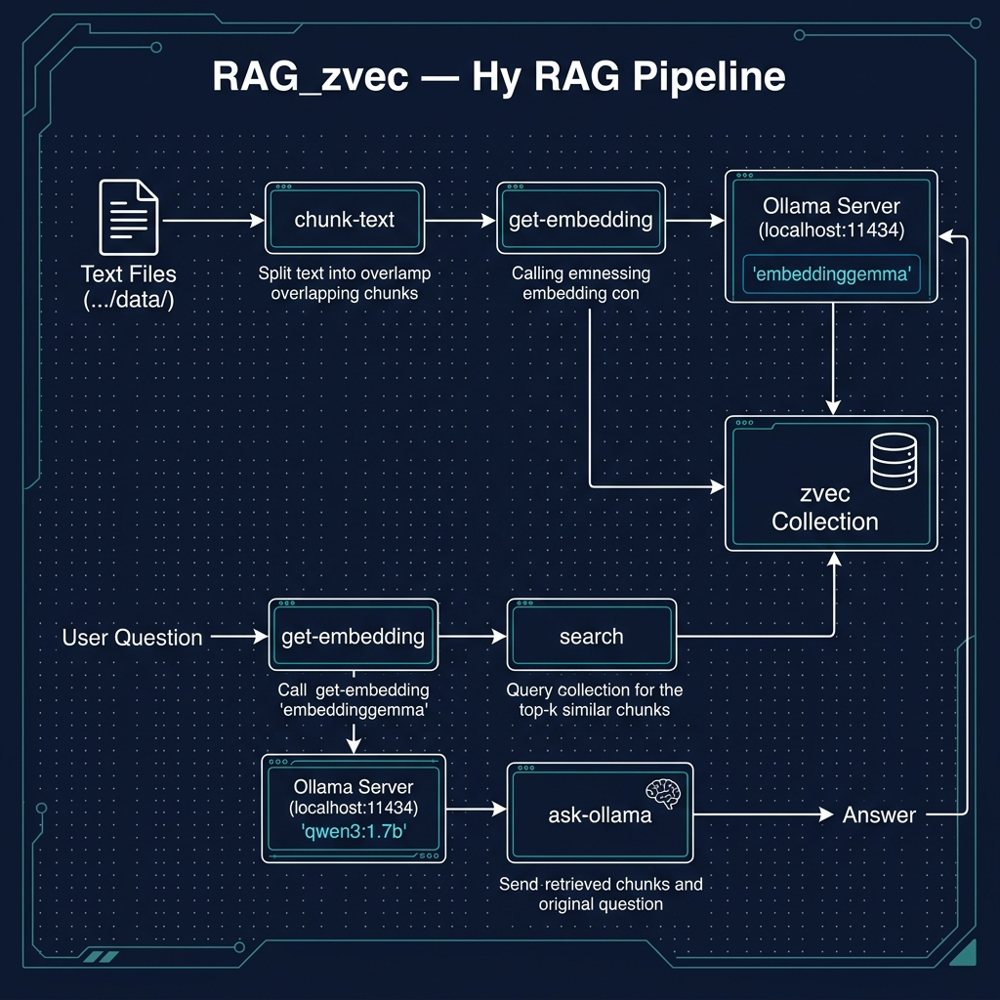

# RAG Using zvec Vector Datastore and Local Model

**Book Chapter:** [RAG Using zvec Vector Datastore and Local Model](https://leanpub.com/read/hy-lisp-python/leanpub-auto-rag-using-zvec-vector-datastore-and-local-model) — *A Lisp Programmer Living in Python-Land* (free to read online).

This example demonstrates a **Retrieval-Augmented Generation (RAG)** pipeline written entirely in Hy. It reads `.txt` files from the `../data` directory, generates embeddings with a local Ollama model, stores them in a [zvec](https://github.com/abusenius/zvec) vector database, and then answers questions by retrieving the most relevant chunks and feeding them as context to a local chat model.



## Prerequisites

- [uv](https://docs.astral.sh/uv/) package manager
- [Ollama](https://ollama.com) running locally with an embedding model (default: `embeddinggemma`) and a chat model (default: `qwen3:1.7b`)

## Running the Example

```bash
uv sync
uv run hy app.hy
```

The program will prompt you for a question. It retrieves the most relevant text chunks from the vector store and uses the local LLM to produce a grounded answer.
