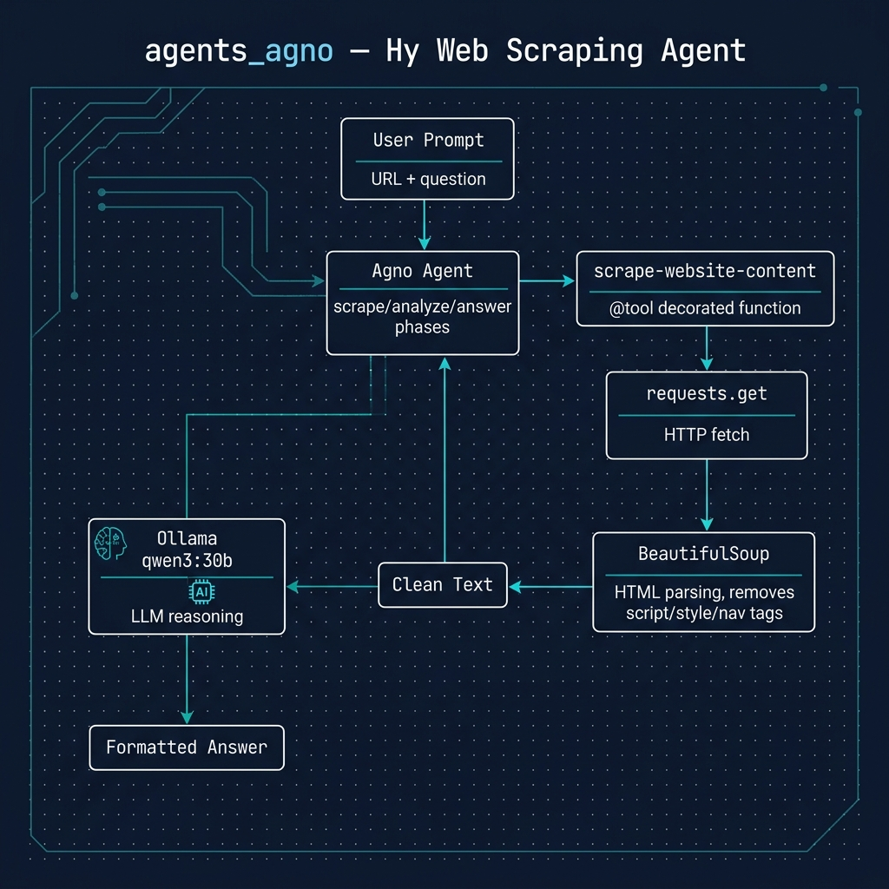

# Agents Using the Agno Agent Framework Running On a Local Ollama Model

**Book Chapter:** [Agents Using the Agno Agent Framework Running On a Local Ollama Model](https://leanpub.com/read/hy-lisp-python/leanpub-auto-agents-using-the-agno-agent-framework-running-on-a-local-ollama-model) — *A Lisp Programmer Living in Python-Land* (free to read online).

This example shows how to build an **AI agent** in Hy using the [Agno](https://github.com/agno-agi/agno) agent framework backed by a local Ollama model. The agent is equipped with a custom `scrape-website-content` tool that fetches and extracts clean text from any web page, enabling it to answer questions about live web content.



## Prerequisites

- [uv](https://docs.astral.sh/uv/) package manager
- [Ollama](https://ollama.com) running locally (the code uses the default Ollama model configured in Agno)

## Running the Example

```bash
uv sync
uv run hy web_site_qa.hy
```

The agent will scrape a web page and answer questions about its content using the local LLM.
