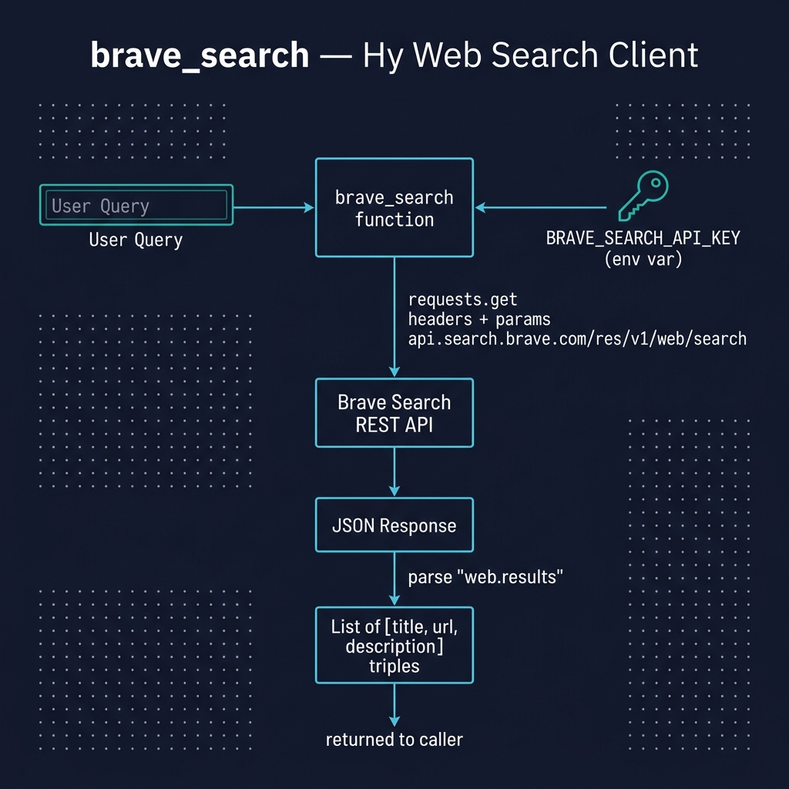

# Using the Brave Search APIs

**Book Chapter:** [Using the Brave Search APIs](https://leanpub.com/read/hy-lisp-python/leanpub-auto-using-the-brave-search-apis) — *A Lisp Programmer Living in Python-Land* (free to read online).

This example demonstrates calling the [Brave Search API](https://brave.com/search/api/) from Hy. The `brave.hy` module provides a `brave-search` function that returns structured search results (title, URL, description). It is designed to be loaded interactively so you can experiment with different queries in the REPL.



## Prerequisites

- [uv](https://docs.astral.sh/uv/) package manager
- A Brave Search API key set as the `BRAVE_API_KEY` environment variable (see book for details on obtaining a key)

## Running the Example

```bash
uv sync
uv run hy -i brave.hy
```

Then call `brave-search` from the REPL:

```lisp
=> (brave-search "site:wikidata.org Sedona Arizona")
[["Sedona - Wikidata" "https://www.wikidata.org/wiki/Q80041" "city in counties of Yavapai and Coconino, ...]]
```
