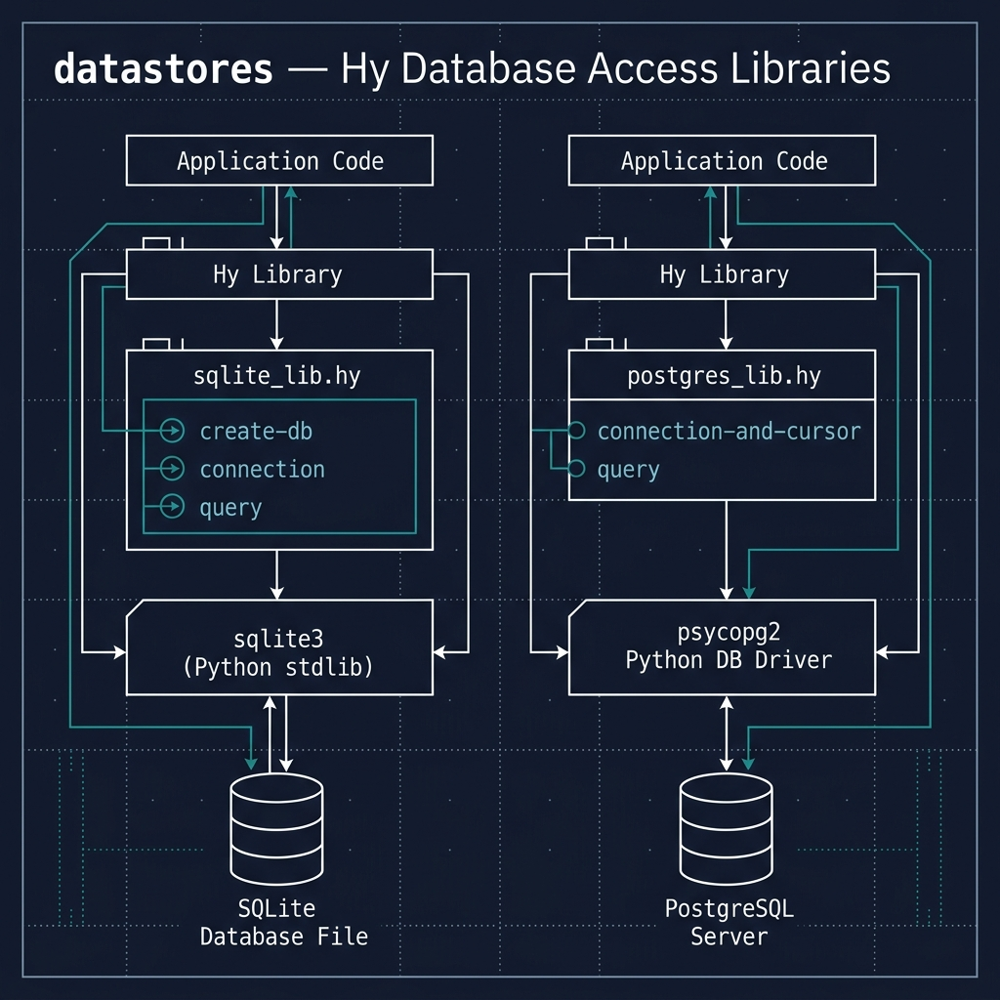

# Datastores

**Book Chapter:** [Datastores](https://leanpub.com/read/hy-lisp-python/leanpub-auto-datastores) — *A Lisp Programmer Living in Python-Land* (free to read online).

This directory contains Hy wrappers and examples for two relational databases:

- **SQLite** (`sqlite_lib.hy` / `sqlite_example.hy`) — uses an in-memory database, so no external setup is needed.
- **PostgreSQL** (`postgres_lib.hy` / `postgres_example.hy`) — requires a running PostgreSQL server. Update the database name and user in `postgres_example.hy` to match your local configuration.

Both examples demonstrate basic CRUD operations (create table, insert, update, query, delete) through a thin Hy wrapper library.



## Prerequisites

- [uv](https://docs.astral.sh/uv/) package manager
- For the PostgreSQL example: a running PostgreSQL server with an existing database

## Running the Examples

```bash
# SQLite (no external dependencies)
uv sync
uv run hy sqlite_example.hy

# PostgreSQL (requires a running server)
uv run hy postgres_example.hy
```

### Expected SQLite Output

```
[]
[]
[('Mark', 'mark@markwatson.com'), ('Kiddo', 'kiddo@markwatson.com')]
[]
[('Mark Watson', 'mark@markwatson.com'), ('Kiddo', 'kiddo@markwatson.com')]
[]
[('Mark Watson', 'mark@markwatson.com')]
```
