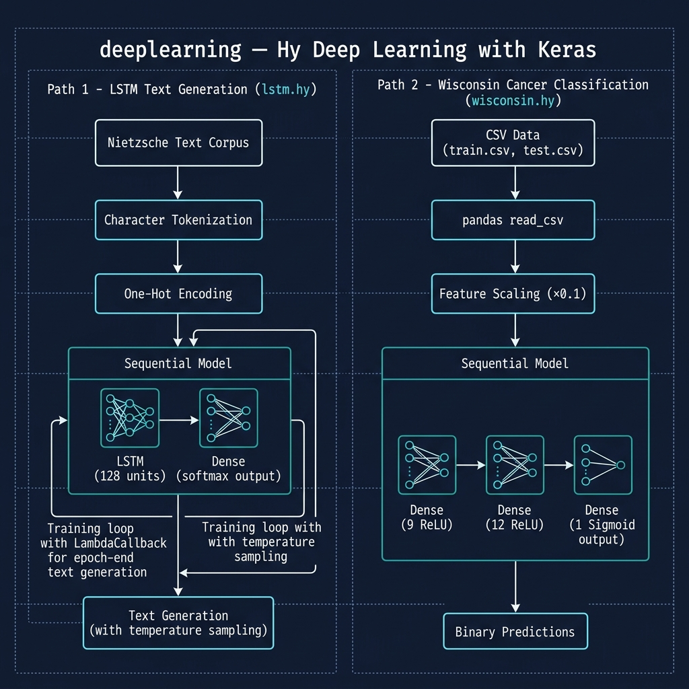

# Deep Learning Examples

**Book Chapter:** [Deep Learning](https://leanpub.com/read/hy-lisp-python/leanpub-auto-deep-learning) — *A Lisp Programmer Living in Python-Land* (free to read online).

Two TensorFlow/Keras deep learning examples written in Hy:

- **`lstm.hy`** — trains an LSTM (Long Short-Term Memory) recurrent neural network on time-series data from `train.csv` / `test.csv`.
- **`wisconsin.hy`** — trains a neural network on the Wisconsin Breast Cancer dataset to classify tumors as benign or malignant. Outputs prediction probabilities alongside expected labels.

Updated to work with TensorFlow 2.20.0 and the latest NumPy.



## Prerequisites

- [uv](https://docs.astral.sh/uv/) package manager

## Running the Examples

```bash
uv sync

# LSTM example
uv run hy lstm.hy

# Wisconsin cancer classification
uv run hy wisconsin.hy
```

**Note:** The `pyproject.toml` must include `hy` as a dependency (via `uv add hy`) so the `hy` executable is available in the local `.venv`.