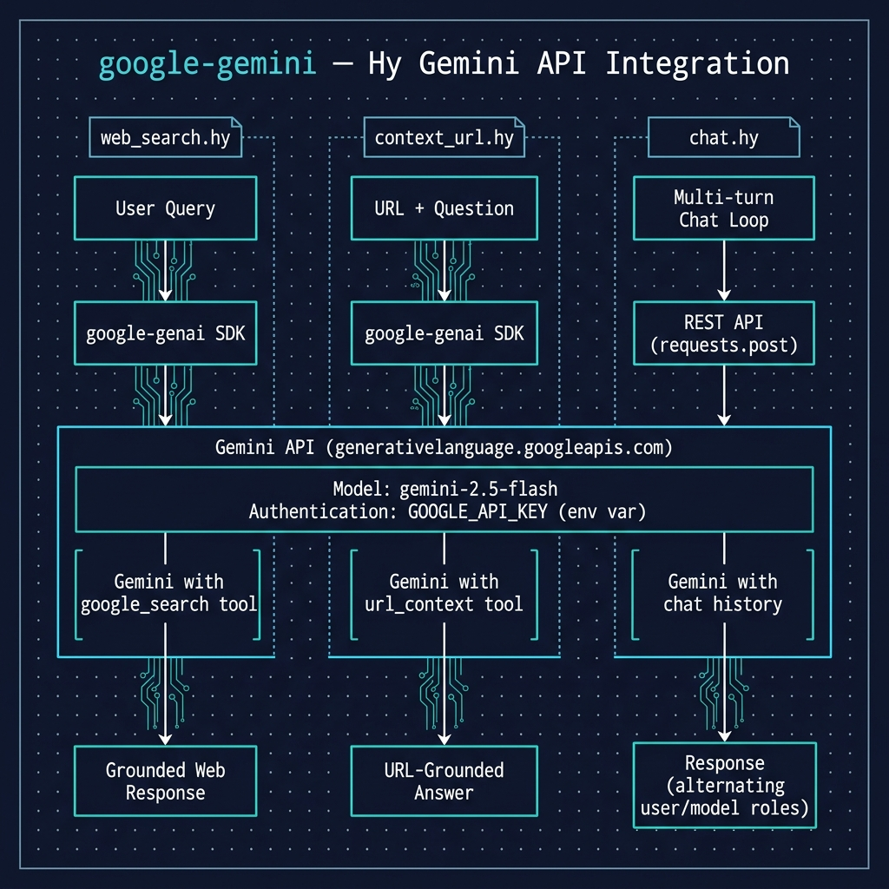

# Using Google Gemini API

**Book Chapter:** [Using Google Gemini API](https://leanpub.com/read/hy-lisp-python/leanpub-auto-using-google-gemini-api) — *A Lisp Programmer Living in Python-Land* (free to read online).

Three examples demonstrating different ways to interact with Google Gemini from Hy:

- **`chat.hy`** — continuous multi-turn chat interface using direct HTTP requests to the Gemini REST API. Maintains conversation history between turns.
- **`web_search.hy`** — performs a live Google search via Gemini's `google_search` tool using the `google-genai` SDK.
- **`context_url.hy`** — answers questions about a web page's content using Gemini's `url_context` tool.

The code demonstrates two architectural approaches: `chat.hy` uses raw HTTP requests for full control, while the other two use Google's Python SDK for simpler tool integration.



## Prerequisites

- [uv](https://docs.astral.sh/uv/) package manager
- `GOOGLE_API_KEY` environment variable set with your Google AI API key

## Running the Examples

```bash
uv sync

# Multi-turn chat
uv run hy chat.hy

# Web search
uv run hy web_search.hy "What is the latest news about the James Webb Space Telescope?"

# Answer questions about a web page
uv run hy context_url.hy
```
