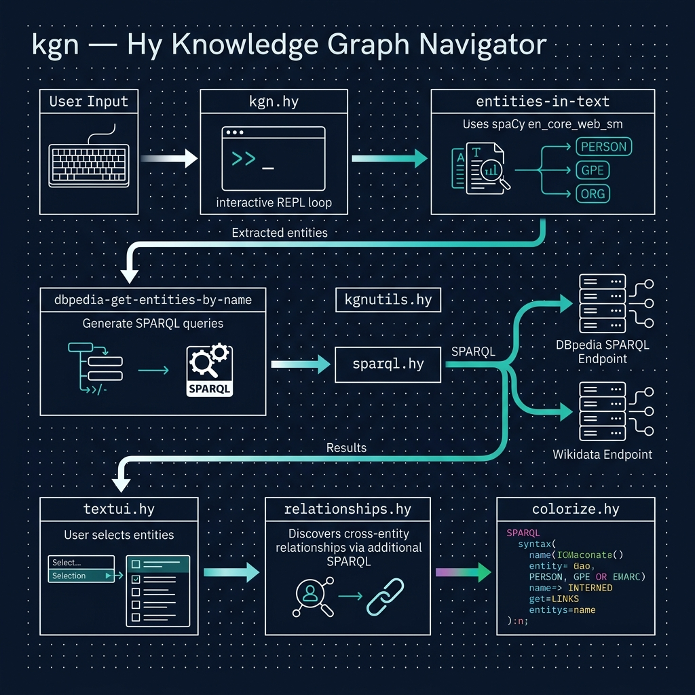

# Knowledge Graph Navigator

**Book Chapter:** [Knowledge Graph Navigator](https://leanpub.com/read/hy-lisp-python/kgn) — *A Lisp Programmer Living in Python-Land* (free to read online).

An interactive tool that extracts named entities (people, places, organizations) from natural-language text using spaCy, looks them up on **DBpedia** via SPARQL queries, and lets you explore the linked data interactively. The project is split across several Hy modules:

- **`kgn.hy`** — main entry point and interactive loop.
- **`kgnutils.hy`** — utility functions for entity processing.
- **`sparql.hy`** — SPARQL query helpers for DBpedia.
- **`relationships.hy`** — relationship extraction between entities.
- **`colorize.hy`** / **`textui.hy`** — terminal UI formatting.



## Prerequisites

- [uv](https://docs.astral.sh/uv/) package manager

## Initial Setup

```bash
uv sync
uv run python -m spacy download en_core_web_sm
```

## Running the Example

```bash
uv run hy kgn.hy
```

When prompted, enter a sentence containing people, places, or organizations. For example:

    Steve Jobs went to Microsoft in Seattle to visit Bill Gates

The program will extract entities, query DBpedia for matches, and let you select which ones to explore further.
