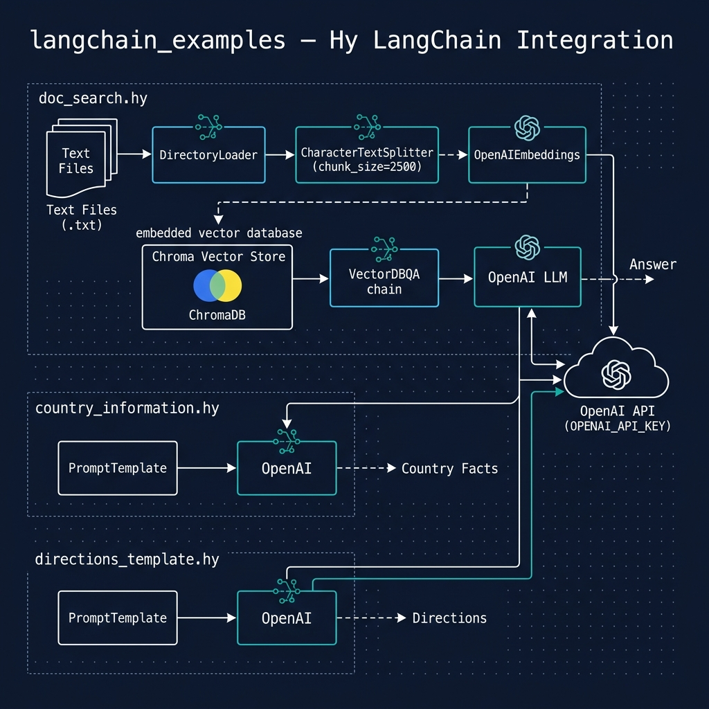

# LangChain Getting Started Examples

**Book Chapter:** [Using LangChain to Chain Together Large Language Models](https://leanpub.com/read/hy-lisp-python/leanpub-auto-using-langchain-to-chain-together-large-language-models) — *A Lisp Programmer Living in Python-Land* (free to read online).

This directory contains three examples that demonstrate using [LangChain](https://www.langchain.com/) from Hy:

- **`country_information.hy`** — queries an LLM for structured information about a country.
- **`directions_template.hy`** — uses a LangChain prompt template to generate step-by-step directions.
- **`doc_search.hy`** — performs semantic search over a set of local documents using embeddings.



## Prerequisites

- [uv](https://docs.astral.sh/uv/) package manager
- An OpenAI API key set as `OPENAI_API_KEY` (LangChain uses OpenAI models by default)

## Running the Examples

```bash
uv sync
uv run hy country_information.hy
uv run hy directions_template.hy
uv run hy doc_search.hy
```
