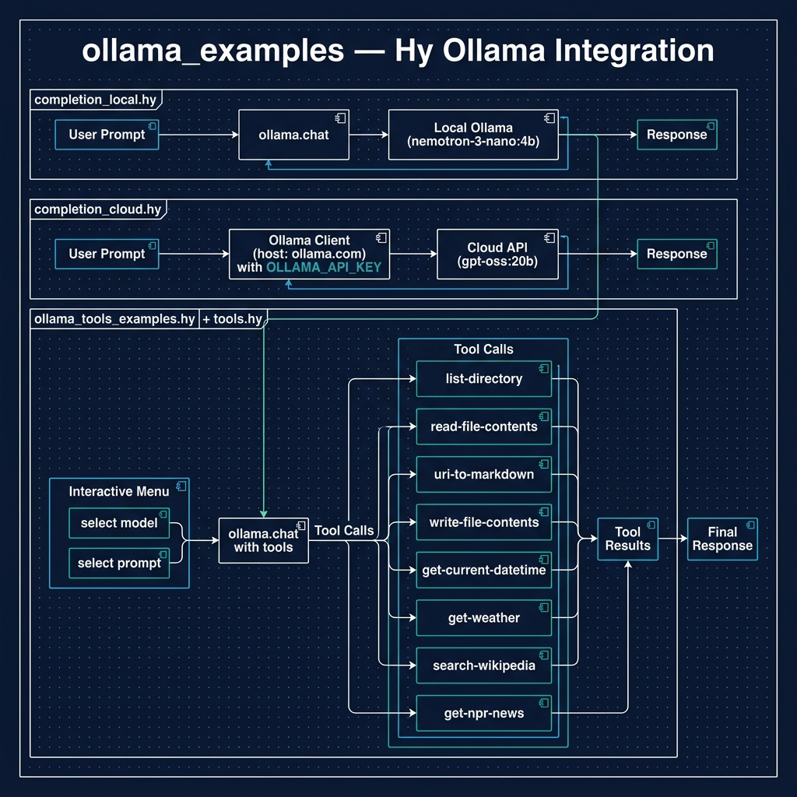

# Running Local LLMs Using Ollama

**Book Chapter:** [Running Local LLMs Using Ollama](https://leanpub.com/read/hy-lisp-python/leanpub-auto-running-local-llms-using-ollama) — *A Lisp Programmer Living in Python-Land* (free to read online).

Examples demonstrating Ollama integration from Hy, including both cloud and local usage:

- **`completion_cloud.hy`** — text completion via the [Ollama Cloud API](https://ollama.com) (requires an API key).
- **`completion_local.hy`** — text completion using a locally running Ollama server.
- **`ollama_tools_examples.hy`** — demonstrates **tool use** (function calling) with Ollama. The LLM can invoke custom tools defined in `tools.hy` (list directories, read files, fetch web pages, search Wikipedia, get weather/news, etc.).



## Prerequisites

- [uv](https://docs.astral.sh/uv/) package manager
- [Ollama](https://ollama.com) installed and running locally (for local examples)
- For cloud examples: `OLLAMA_API_KEY` environment variable set with your API key

## Running the Examples

```bash
uv sync

# Cloud completion
uv run hy completion_cloud.hy

# Local completion
uv run hy completion_local.hy

# Tool use example
uv run hy ollama_tools_examples.hy
```
