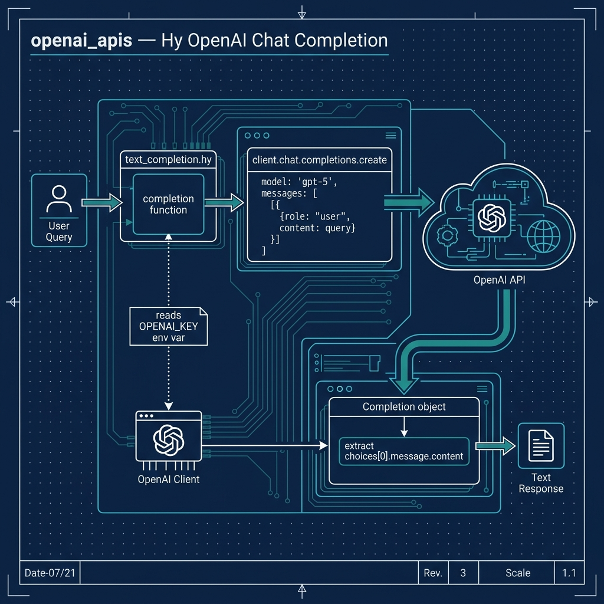

# OpenAI Completion Example

**Book Chapter:** [Using OpenAI GPT](https://leanpub.com/read/hy-lisp-python/leanpub-auto-using-openai-gpt) — *A Lisp Programmer Living in Python-Land* (free to read online).

This example demonstrates calling the **OpenAI GPT chat completion API** from Hy using the [openai](https://pypi.org/project/openai/) Python package. The script `text_completion.hy` sends a prompt to the model and prints the response.



## Prerequisites

- [uv](https://docs.astral.sh/uv/) package manager
- An OpenAI API key set as the `OPENAI_API_KEY` environment variable

## Running the Example

```bash
uv sync
uv run hy text_completion.hy
```
