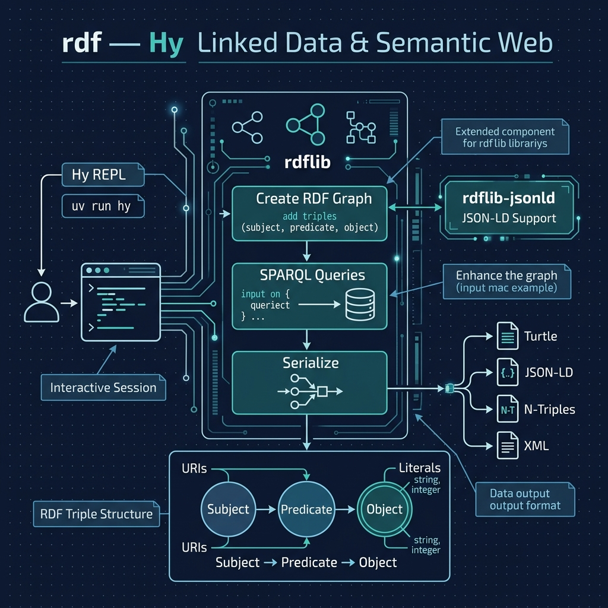

# Linked Data, the Semantic Web, and Knowledge Graphs

**Book Chapter:** [Linked Data, the Semantic Web, and Knowledge Graphs](https://leanpub.com/read/hy-lisp-python/leanpub-auto-linked-data-the-semantic-web-and-knowledge-graphs) — *A Lisp Programmer Living in Python-Land* (free to read online).

This directory is set up for **interactive REPL experimentation** with RDF data using the [rdflib](https://rdflib.readthedocs.io/) Python library. The `pyproject.toml` includes `rdflib` and `rdflib-jsonld` as dependencies so you can follow along with the book's examples for creating, querying, and serializing RDF graphs in Hy.



## Prerequisites

- [uv](https://docs.astral.sh/uv/) package manager

## Running the REPL

```bash
uv sync
uv run hy
```

Then follow the interactive examples in the book chapter to create RDF triples, run SPARQL queries, and serialize graphs to different formats (Turtle, JSON-LD, N-Triples, etc.).
