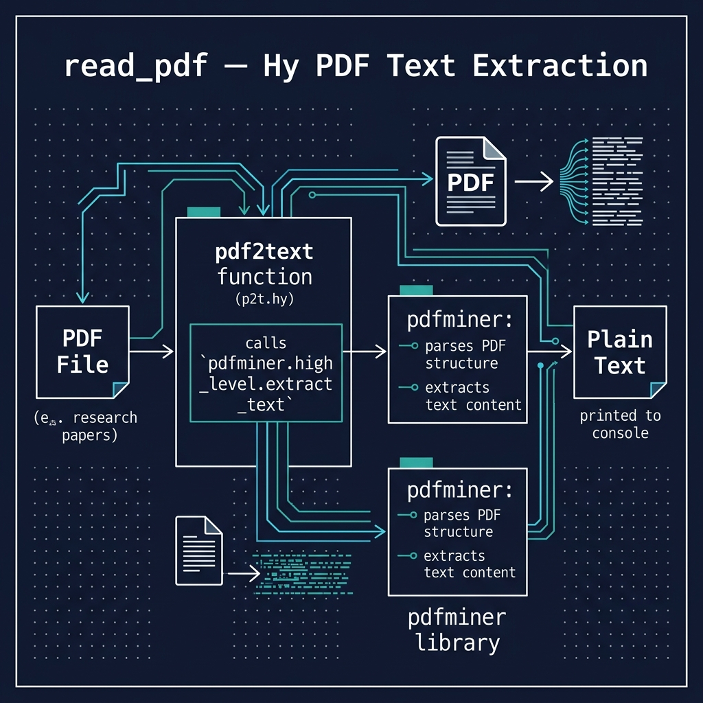

# Convert PDF Files to Text

**Note:** This example is a work in progress and is **not yet covered in the book**.

This script uses [pdfminer](https://pdfminersix.readthedocs.io/) to extract plain text from PDF files. The original motivation is to convert academic papers to clean text suitable for text-to-speech (audio reading) apps, which tend to struggle with footnotes, tables, and other PDF artifacts.



## Prerequisites

- [uv](https://docs.astral.sh/uv/) package manager

## Running the Example

```bash
uv sync
uv run hy p2t.hy
```

The script extracts text from the included sample PDF (`Sales force - Multi-Hop Knowledge Graph Reasoning with Reward Shaping.pdf`) and prints it to stdout.
